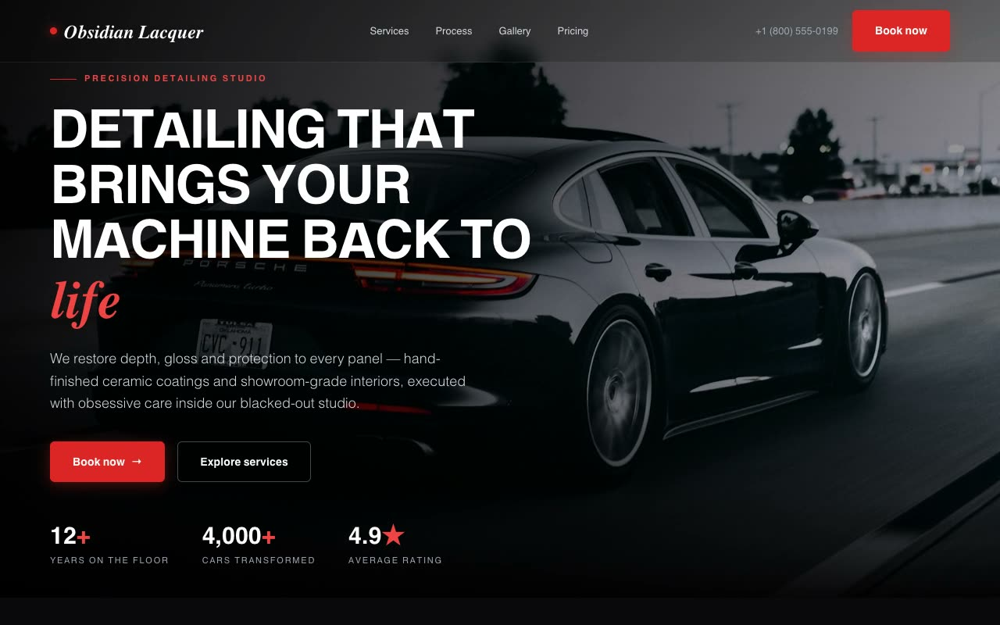

# Obsidian Lacquer — Cinematic Automotive Detailing Studio Landing Page (Vanilla HTML/CSS/JS)

[](./demo.mp4)

A multi-section landing page for Obsidian Lacquer, a fictional high-end automotive detailing and paint-protection studio, built on an "Obsidian Lacquer" design language — a dark, cinematic, showroom-floor aesthetic: wet-look black paint under a single raking light, a scalpel of vermilion red for energy, and pristine editorial type (Playfair Display italic wordmark, Bricolage Grotesque/Inter Tight). Sections include a fixed backdrop-blur navbar, a full-viewport hero with Ken-Burns/parallax background, an asymmetric 12-column services grid, a hover-reveal process section, testimonials, a snap-scroll before/after gallery driven by arrow buttons, a pricing section with monthly/yearly toggle, and a final CTA — with a custom dark scrollbar and `prefers-reduced-motion` support, self-contained and offline-runnable. Generated with Claude Fable 5.

## Run

This is a static project — open `index.html` in a browser, or serve the folder:

```sh
python3 -m http.server 8000
```

See `prompt.md` for the full build spec; `demo.mp4` shows it in motion.

---

Part of the [Landing pages](../) collection in the [claude-directory](../../) — an open-source gallery of AI-generated UI built with Claude Fable 5. [Browse the live gallery](https://pulkitxm.com/claude-directory).
