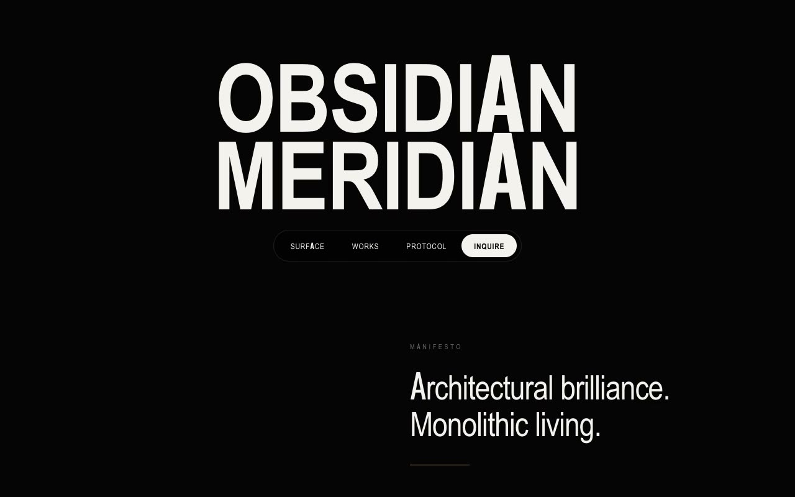

# Obsidian Meridian — Luxury Real-Estate & Architecture Landing Page (HTML + CSS + Vanilla JS)

[](./demo.mp4)

A single-page marketing landing page for Obsidian Meridian, a fictional elite architecture studio and luxury real-estate developer. The design language is "Cinematic Brutalist Noir" — the hushed restraint of a printed architecture monograph fused with the graded darkness of a film still — on a true-black canvas with warm brass accents and razor hairlines. Features include a per-letter wordmark reveal, an infinite Ken-Burns cinematic hero, a staggered selected-works grid, count-up stats, and a minimal inquiry form — all built with pure HTML, CSS, and vanilla JS. Generated with Claude Fable 5.

## Run

This is a static project — open `index.html` in a browser, or serve the folder:

```sh
python3 -m http.server 8000
```

See `prompt.md` for the full build spec; `demo.mp4` shows it in motion.

---

Part of the [Landing pages](../) collection in the [claude-directory](../../) — an open-source gallery of AI-generated UI built with Claude Fable 5. [Browse the live gallery](https://pulkitxm.com/claude-directory).
