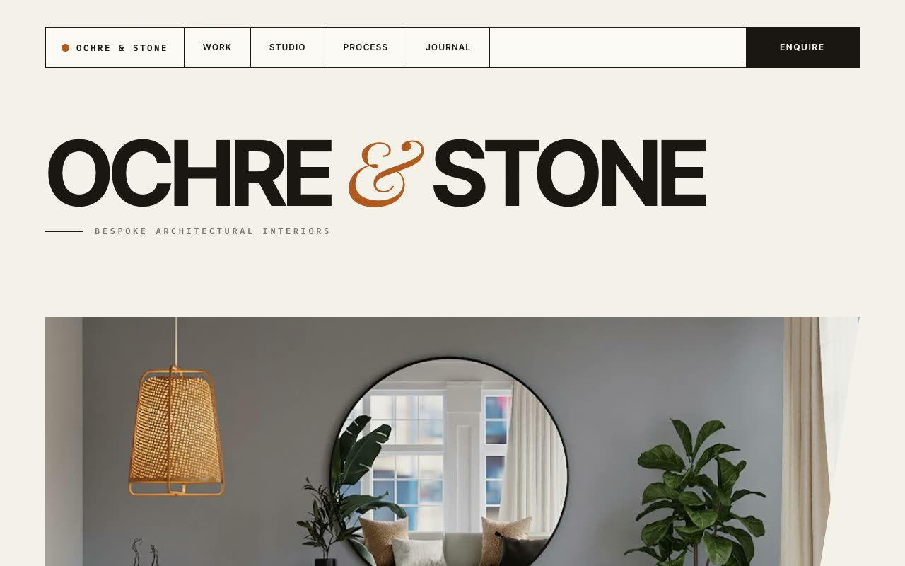

# Ochre & Stone — Bespoke Architectural Interiors Landing Page (HTML + CSS + Vanilla JS)

[](./demo.mp4)

A multi-section marketing landing page for Ochre & Stone, a fictional high-end interior-architecture studio. The design language is "Warm Editorial Minimalism" — a gallery-like, print-magazine feel built on 1px hairline rules, generous whitespace, and a single burnt-ochre accent glowing against a warm bone-paper canvas and near-black ink. Sections include a bordered floating nav with flip-up hover cells, an angled clip-path hero with an auto-rotating floating card, a marquee strip, an asymmetric bento project grid, a scattered freefall phase-card methodology section, an inverted ink testimonial, a CTA, and a four-column footer — all built with vanilla HTML, CSS, and JS. Generated with Claude Fable 5.

## Run

This is a static project — open `index.html` in a browser, or serve the folder:

```sh
python3 -m http.server 8000
```

See `prompt.md` for the full build spec; `demo.mp4` shows it in motion.

---

Part of the [Landing pages](../) collection in the [claude-directory](../../) — an open-source gallery of AI-generated UI built with Claude Fable 5. [Browse the live gallery](https://pulkitxm.com/claude-directory).
