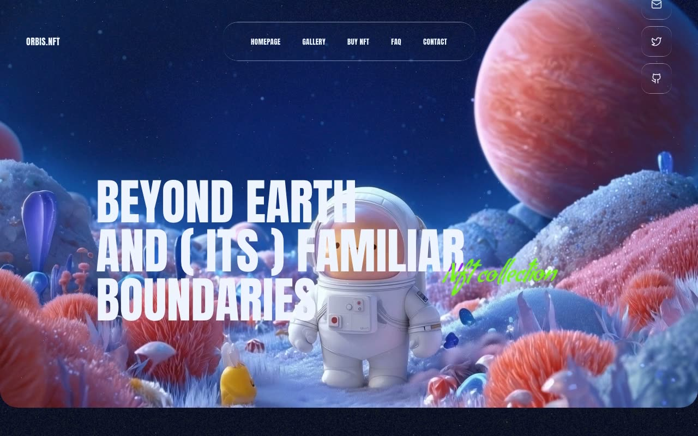

# Orbis.Nft — Dark Space NFT Landing Page (React + Vite + Tailwind CSS)

[](./demo.mp4)

A single-page NFT landing site with four full-bleed sections (Hero, About, Collection, CTA) on a dark space theme. The page uses looping muted background videos, a CSS liquid-glass UI effect, a fixed grain texture overlay, and a tight color system (deep navy `#010828`, off-white `#EFF4FF`, neon green `#6FFF00`; Anton headings, Condiment cursive accents, system mono body). Showcases a three-card NFT collection grid with rarity scores and video previews. Generated with Claude Fable 5.

Built with React 18 + Vite and TypeScript, styled with Tailwind CSS 3. Notable techniques: looping autoplay video backgrounds, a CSS liquid-glass effect (backdrop blur + gradient-masked border), a full-screen fixed texture overlay with `mix-blend-mode`, and the padding-bottom square aspect-ratio trick for NFT cards. Lucide supplies the social icons.

## Run

```sh
npm install
npm run dev               # Vite dev server
npm run build             # tsc --noEmit && vite build
npm run preview           # preview the production build
npm run generate:texture  # node scripts/generate-texture.mjs
npm run verify            # node scripts/verify.mjs
```

See `prompt.md` for the full build spec; `demo.mp4` shows it in motion.

---

Part of the [Landing pages](../) collection in the [claude-directory](../../) — an open-source gallery of AI-generated UI built with Claude Fable 5. [Browse the live gallery](https://pulkitxm.com/claude-directory).
