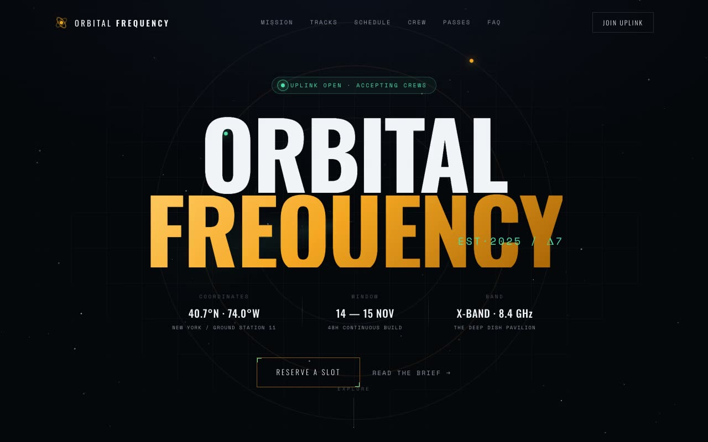

# Orbital Frequency — Deep-Space Signals Summit Landing Page (HTML + CSS + Vanilla JS)

[](./demo.mp4)

A multi-section landing page for Orbital Frequency, a fictional two-day deep-tech summit for aerospace engineers, ground-station operators, and signals-software hackers. The "Deep Signal" aesthetic uses an observatory-at-night visual language built around telemetry, radar sweeps, orbital rings, and mission-control readouts on a near-black backdrop with warm amber-gold and signal-green accents. Features rotating orbital rings, a sweeping radar cone, drifting star particles, a telemetry strip, live count-up stats, and a scroll-depth signal bar — all built with vanilla HTML, CSS custom properties, and JS. Generated with Claude Fable 5.

## Run

This is a static project — open `index.html` in a browser, or serve the folder:

```sh
python3 -m http.server 8000
```

See `prompt.md` for the full build spec; `demo.mp4` shows it in motion.

---

Part of the [Landing pages](../) collection in the [claude-directory](../../) — an open-source gallery of AI-generated UI built with Claude Fable 5. [Browse the live gallery](https://pulkitxm.com/claude-directory).
