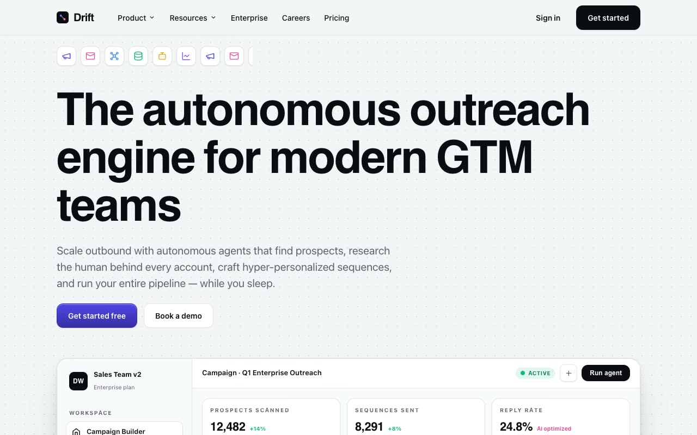

# Paper Circuit — Agentic Outbound SaaS Landing Page (DRIFT) (HTML + CSS + Vanilla JS)

[](./demo.mp4)

A multi-section marketing landing page for Driftworks (product wordmark: "DRIFT"), a fictional autonomous-outbound SaaS. The "Paper Circuit" design language reads like a blueprint printed on graph paper: a light neutral canvas with a faint radial dot grid, crisp hairlines, floating white panels with soft shadows, and color used sparingly as wiring (electric indigo, hot magenta). Sections include a sticky header with hover-dropdown nav, a hero with an auto-advancing icon belt and a detailed product mockup featuring a mouse-driven 3D parallax, a logo strip, a 12-column features bento, portrait testimonials, an enterprise governance layout, an indigo stats/CTA strip with a live mono counter, and a cursor-spotlight wordmark footer — all built with pure HTML, CSS, and vanilla JS. Generated with Claude Fable 5.

## Run

This is a static project — open `index.html` in a browser, or serve the folder:

```sh
python3 -m http.server 8000
```

See `prompt.md` for the full build spec; `demo.mp4` shows it in motion.

---

Part of the [Landing pages](../) collection in the [claude-directory](../../) — an open-source gallery of AI-generated UI built with Claude Fable 5. [Browse the live gallery](https://pulkitxm.com/claude-directory).
