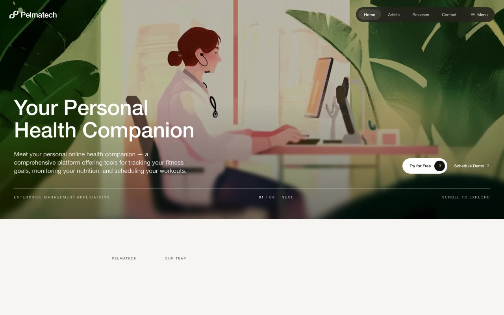

# Pelmatech — Personal Health Companion Landing Page (React + TanStack Start + Tailwind v4)

[](./demo.mp4)

A pixel-faithful recreation of the Pelmatech landing page — a health-tech marketing site for a personal online health companion platform. Features a full-bleed dark hero with animated headline, a horizontal team carousel with a central blurred arrow puck, and a three-card benefits grid on a surface background with custom edge-fading gridlines. Built with React + TanStack Start + TypeScript + Tailwind v4 (shadcn-ui base), `motion/react` (Framer Motion), and `lucide-react`. Generated with Claude Fable 5.

## What's inside

- **Hero** — full-bleed doctor-at-computer photo with two stacked dark overlays,
  animated headline (`72.73px`), description, "Try for Free" / "Schedule Demo"
  CTAs, and an uppercase footer strip.
- **Team section** — eyebrow row + `58.55px` heading, left-padded by `335.26px`
  to align with the first carousel card, plus a horizontal team carousel
  (`visible = 3.25`, `GAP = 11.26px`) with a central 126px blurred arrow puck
  that appears on hover and slides the track with a cubic ease.
- **Benefits section** — 3-card grid on `bg-surface` with custom interior
  vertical gridlines and edge-fading horizontal lines; card 02 ("Unethical") is
  reversed (image on top).
- **Responsive zoom** — the whole document is uniformly downscaled below 1728px
  via CSS `zoom`, applied through a dedicated `<style>` rule both in an inline
  shell script (pre-hydration, no flash) and a post-hydration `useEffect`.
- **Animation primitives** (`AnimatedHeading`, `AnimatedText`, `MaskedImage`) —
  every headline, paragraph, and image enters with the exact motion definitions
  from the spec (blur-up headings, fade-up text, bottom-to-top clip-path image
  reveals).

All design tokens are defined in `oklch` in `src/styles.css`; no extra tokens
were invented.

## Assets

All 9 image assets (doctor portraits, still lifes, and the white/black
Pelmatech logos) are **vendored locally** under `src/assets/` and imported via
`@/assets/<file>` — the project is fully self-contained and runs offline.

## Running

```bash
npm install
npm run dev        # http://localhost:5173
npm run build      # production build (client + server)
npm run typecheck  # tsc --noEmit
```

A `demo.mp4` walkthrough (recorded with the repo's `scripts/record-demos`
recorder) sits alongside this README.

---

Part of the [Landing pages](../) collection in the [claude-directory](../../) — an open-source gallery of AI-generated UI built with Claude Fable 5. [Browse the live gallery](https://pulkitxm.com/claude-directory).
