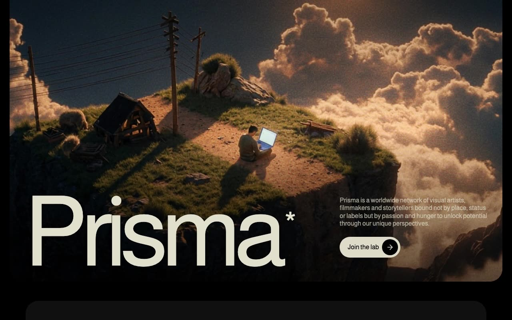

# Prisma — Creative Studio Landing Page (React + Vite + Tailwind CSS + Framer Motion)

[](./demo.mp4)

A dark, moody, cinematic single-page landing site for Prisma, a fictional worldwide creative studio and visual arts collective. Three stacked sections — Hero, About, and Features — sit on a black background with a warm cream accent (`#DEDBC8`), with Almarai headings and Instrument Serif italic for accent words. Showcases pull-up word reveals, scroll-linked per-character opacity in the About paragraph, staggered card entrances in Features, and inline SVG `feTurbulence` noise textures. Generated with Claude Fable 5.

Built with React 18 + Vite and TypeScript, styled with Tailwind CSS 3. Animation is Framer Motion: `WordsPullUp` / `WordsPullUpMultiStyle` components, fade-ins, `useScroll` + `useTransform` scroll-driven animation, and `useInView`-triggered card entrances. Icons come from Lucide.

## Run

```sh
npm install
npm run dev      # Vite dev server
npm run build    # tsc && vite build
npm run preview  # preview the production build
```

See `prompt.md` for the full build spec; `demo.mp4` shows it in motion.

---

Part of the [Landing pages](../) collection in the [claude-directory](../../) — an open-source gallery of AI-generated UI built with Claude Fable 5. [Browse the live gallery](https://pulkitxm.com/claude-directory).
