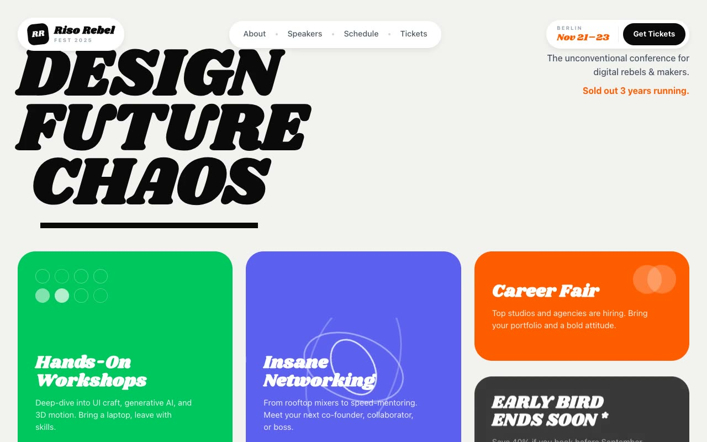

# Riso Rebel Fest — Design Conference Landing Page (HTML + CSS + Vanilla JS)

[](./demo.mp4)

A multi-section landing page for "Riso Rebel Fest", a fictional unconventional design conference. The "Floating-Pill Neo-Brutalism" aesthetic uses a warm off-white canvas with a matted-frame outer padding, content grouped into bold oversized rounded cards in saturated risograph color blocks, a chunky display serif paired with a clean grotesque, and floating pill chrome (nav, chips, buttons) sitting on the page like stickers. Sections include a sticky three-pill floating header, a type-as-hero headline ("DESIGN / FUTURE / CHAOS"), a bento feature-card grid with animated geometric motifs, a four-up speaker lineup, an agenda card, a three-tier tickets section, a dashed-border newsletter card, and footer — all built with vanilla HTML, CSS, and JS. Generated with Claude Fable 5.

## Run

This is a static project — open `index.html` in a browser, or serve the folder:

```sh
python3 -m http.server 8000
```

See `prompt.md` for the full build spec; `demo.mp4` shows it in motion.

---

Part of the [Landing pages](../) collection in the [claude-directory](../../) — an open-source gallery of AI-generated UI built with Claude Fable 5. [Browse the live gallery](https://pulkitxm.com/claude-directory).
