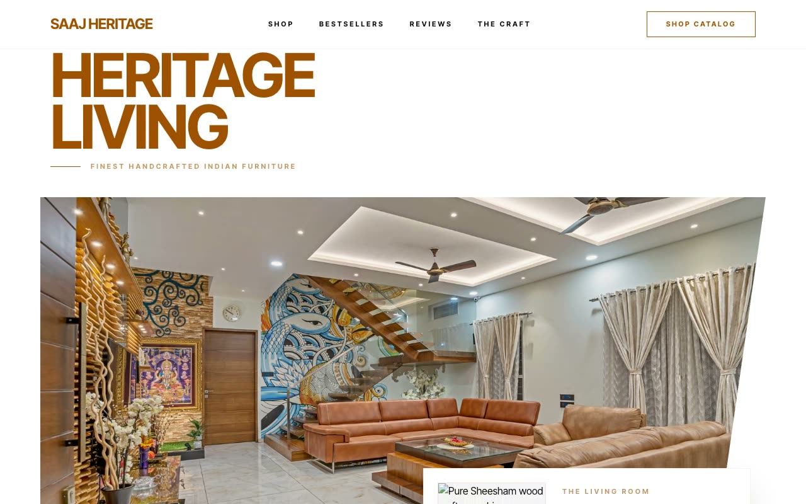

# Saaj Heritage — Handcrafted Indian Furniture D2C Landing Page (Vanilla HTML/CSS/JS)

[](./demo.mp4)

A multi-section marketing and commerce landing page for Saaj Heritage, a fictional direct-to-consumer Indian solid-wood furniture house rooted in Rajasthan. The named aesthetic is "Heritage Bazaar Editorial" — a warm, artisanal storefront that reads like a printed heritage catalog crossed with a modern D2C site: cream paper canvas, sandstone hairlines, a deep burnt-sienna brand color, hard square corners, and confident editorial type (Inter Tight, Playfair Display). Generated with Claude Fable 5.

Sections include a sticky blurred header, a hero with an angled clip-path image cutout and an auto-rotating floating product card, a shop-by-category row, a curated bestsellers product grid (INR pricing, hover "view product" bars), a values strip, testimonials, a "The Craft" stroke-to-fill numbered process, a sienna consultation CTA with a validating form, and footer. Vanilla HTML/CSS/JS with IntersectionObserver scroll reveals, a 5s hero card rotation, hover image zooms, header compress-on-scroll, and `prefers-reduced-motion` support. Self-contained and offline-runnable.

## Run

This is a static project — open `index.html` in a browser, or serve the folder:

```sh
python3 -m http.server 8000
```

See `prompt.md` for the full build spec; `demo.mp4` shows it in motion.

---

Part of the [Landing pages](../) collection in the [claude-directory](../../) — an open-source gallery of AI-generated UI built with Claude Fable 5. [Browse the live gallery](https://pulkitxm.com/claude-directory).
