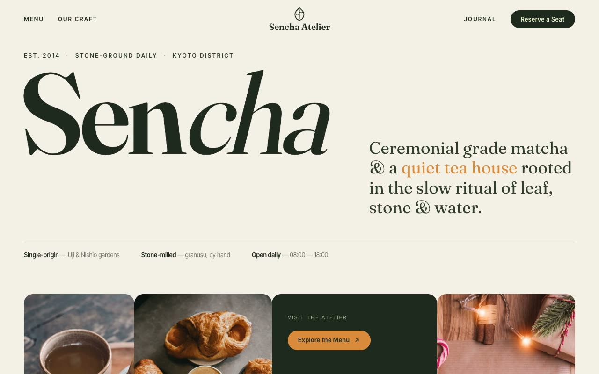

# Sencha Atelier — Ceremonial Japanese Tea House Landing Page (Vanilla HTML/CSS/JS)

[](./demo.mp4)

A multi-section landing page for Sencha Atelier, a fictional artisanal Japanese tea atelier. The named design language is "Wabi Editorial" — a quiet, gallery-like composition that reads like a printed monograph about tea: warm paper backgrounds, deep pine/moss green as the structural color, and a single warm saffron-amber accent used sparingly, with generous negative space and oversized editorial serif type. Generated with Claude Fable 5.

Sections include a transparent-to-blurred fixed header with a centered leaf-mark logo, a hero with a massive bottom-aligned "SENCHA" wordmark, a flush four-card showcase row, a philosophy/craft editorial block, an editorial menu list, a deep-pine stats ribbon with a marquee, an atmosphere gallery mosaic, a reserve CTA, and a pine-green footer. Vanilla HTML/CSS/JS with IntersectionObserver fade-up reveals (staggered showcase cards), header blur on scroll, count-up stats, a slow term marquee, and `prefers-reduced-motion` support. Self-contained and offline-runnable.

## Run

This is a static project — open `index.html` in a browser, or serve the folder:

```sh
python3 -m http.server 8000
```

See `prompt.md` for the full build spec; `demo.mp4` shows it in motion.

---

Part of the [Landing pages](../) collection in the [claude-directory](../../) — an open-source gallery of AI-generated UI built with Claude Fable 5. [Browse the live gallery](https://pulkitxm.com/claude-directory).
