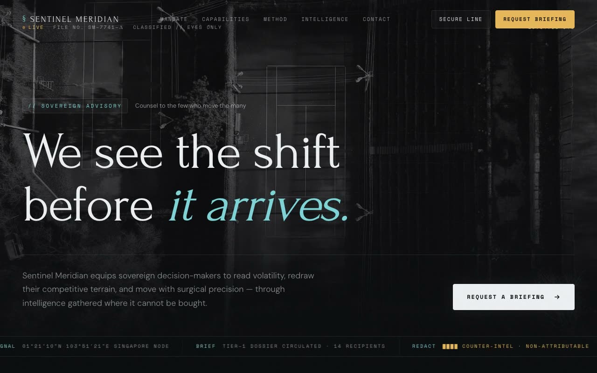

# Sentinel Meridian — Intelligence & Strategy Advisory Landing Page (Vanilla HTML/CSS/JS)

[](./demo.mp4)

A single-page marketing site for Sentinel Meridian, a fictional elite private-intelligence and strategic-advisory firm. The named aesthetic is "Cold War Dossier" — a hushed, classified, architectural dark theme that reads like a declassified intelligence brief crossed with a luxury private bank: near-black ink, a cold ice/steel cyan accent, and a single warm signal-amber used only for "classified / live" labels and the primary CTA glow. Generated with Claude Fable 5.

Sections include a fixed nav that blurs on scroll, a full-viewport hero with a Ken-Burns grayscale background, a live dossier header strip with a ticking UTC clock and a mono intelligence-feed ticker, a mandate/DNA split, a capabilities grid, a three-step method, a count-up stats row, a final CTA, and footer. Self-contained static HTML/CSS/JS with a per-line headline mask reveal, IntersectionObserver reveals, the live clock and ticker, count-up stats, custom cyan-on-ink selection, a slim scrollbar, and `prefers-reduced-motion` support. Fonts and grayscale architectural imagery vendored locally.

## Run

This is a static project — open `index.html` in a browser, or serve the folder:

```sh
python3 -m http.server 8000
```

See `prompt.md` for the full build spec; `demo.mp4` shows it in motion.

---

Part of the [Landing pages](../) collection in the [claude-directory](../../) — an open-source gallery of AI-generated UI built with Claude Fable 5. [Browse the live gallery](https://pulkitxm.com/claude-directory).
