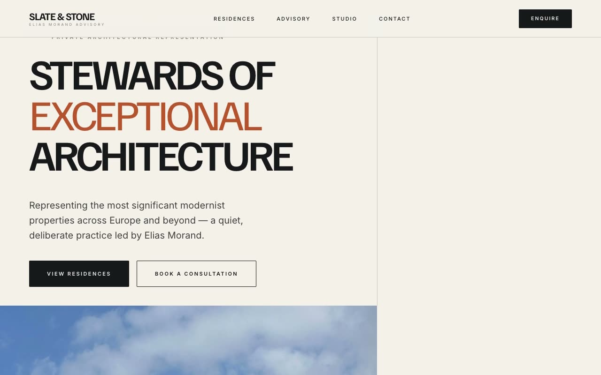

# Slate & Stone — Architectural Real-Estate Advisory Landing Page (Vanilla HTML/CSS/JS)

[](./demo.mp4)

A single-page marketing landing site for "Slate & Stone", a fictional ultra-high-net-worth architectural real-estate advisory led by principal agent Elias Morand. The named aesthetic is "Gallery Minimalism" — a quiet, editorial, fine-art-auction-house feel where architecture is treated like a collectible object: hairline rules, generous whitespace, oversized condensed uppercase display type, a warm paper ground, and a single sparing rust/terracotta "oxide" accent. Generated with Claude Fable 5.

The signature grid is an asymmetric 62.7% / 37.3% split reused across sections: a sticky header, an asymmetric hero with a letterbox banner, a stats strip, a principal/bio split, a hairline-divided featured-residences grid, an inverted dark advisory panel, a centered pull-quote, a minimal underline-input contact split, and a 12-column footer. Self-contained static HTML/CSS + vanilla JS with IntersectionObserver scroll reveals, a staggered hero intro, image hover scaling, optional count-up stats, a full-screen mobile menu, a custom thin scrollbar, and `prefers-reduced-motion` support.

## Run

This is a static project — open `index.html` in a browser, or serve the folder:

```sh
python3 -m http.server 8000
```

See `prompt.md` for the full build spec; `demo.mp4` shows it in motion.

---

Part of the [Landing pages](../) collection in the [claude-directory](../../) — an open-source gallery of AI-generated UI built with Claude Fable 5. [Browse the live gallery](https://pulkitxm.com/claude-directory).
