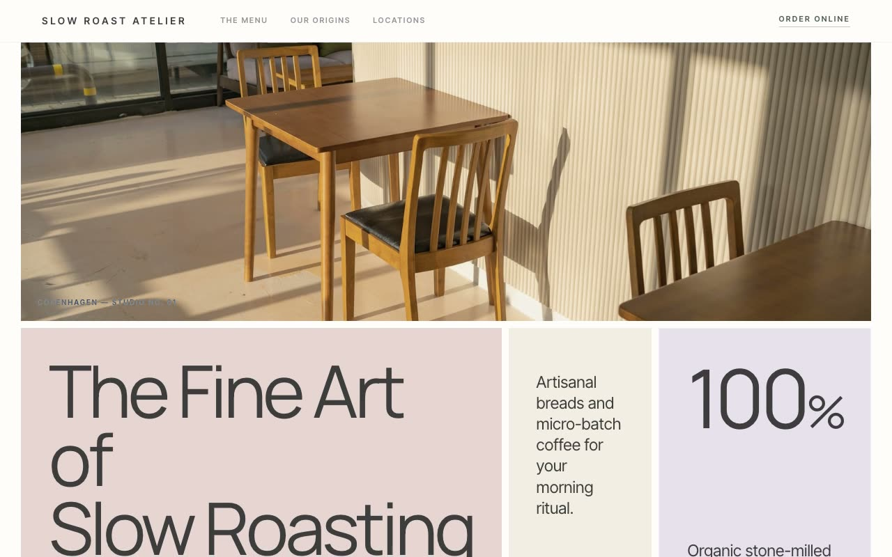

# Slow Roast Atelier — Artisan Coffee & Bakery Landing Page (Vanilla HTML/CSS/JS)

[](./demo.mp4)

A multi-section landing page for Slow Roast Atelier, a fictional artisan coffee roastery and micro-bakery. The named design language is "Quiet Pastel Block-Grid" — a calm, gallery-like editorial aesthetic built entirely from edge-to-edge rectangular panels of muted dusty pastel color, like a Swiss magazine spread reassembled into a Mondrian of warm neutrals, grounded by one deep pine green used sparingly. Generated with Claude Fable 5.

Sections include a sticky blurred header, a signature hero (a photo strip over a three-column asymmetric `740fr / 380fr / 324fr` block row), a three-cell menu preview, an origins/philosophy split with a circular "direct trade" badge, a three-card visit row, a footer with an email-subscribe form, and a slide-in mobile nav overlay. Pure HTML/CSS/vanilla JS with IntersectionObserver fade-up reveals, grayscale-to-color image hovers, a nudging CTA arrow, and `prefers-reduced-motion` support. Manrope + Inter Tight and all photography vendored locally; offline-runnable.

## Run

This is a static project — open `index.html` in a browser, or serve the folder:

```sh
python3 -m http.server 8000
```

See `prompt.md` for the full build spec; `demo.mp4` shows it in motion.

---

Part of the [Landing pages](../) collection in the [claude-directory](../../) — an open-source gallery of AI-generated UI built with Claude Fable 5. [Browse the live gallery](https://pulkitxm.com/claude-directory).
