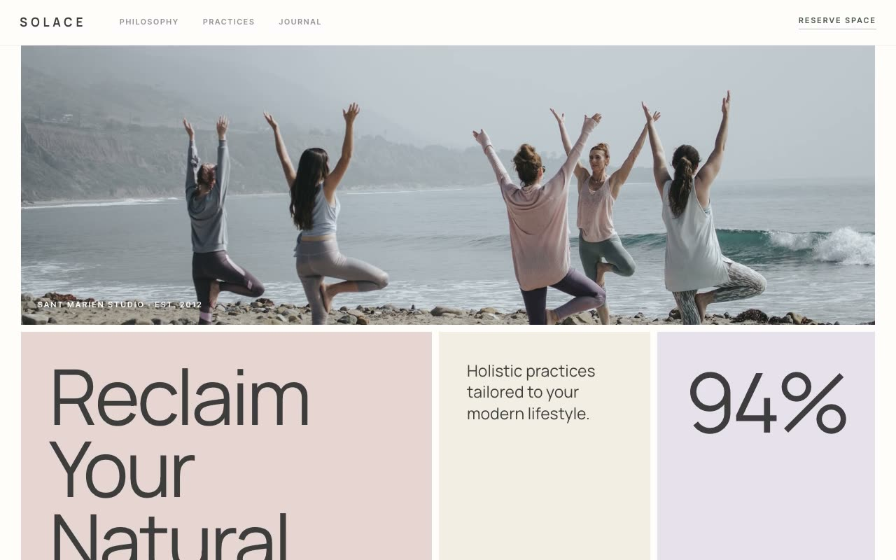

# Solace — Holistic Wellness Studio Landing Page (Vanilla HTML/CSS/JS + Bento Grid)

[](./demo.mp4)

A single-page marketing landing site for "Solace", a fictional modern holistic wellness studio. The named aesthetic is "Quiet Luxury Wellness" — a warm, sun-washed editorial-magazine feel built on an asymmetric bento color-block grid: flat matte panels in an earthy palette butting against each other with hairline gutters, oversized light-weight display type, and generous negative space. Generated with Claude Fable 5.

Sections include a sticky blurred header, a signature bento hero (an image strip over a three-panel `740fr 380fr 324fr` row with headline, philosophy/CTA, and an impact stat), a keyword marquee, a philosophy editorial, a bento practices grid, a sage stats band, a practitioner/guides row, a reserve/CTA section, and footer. Self-contained static HTML/CSS (custom-property tokens) + vanilla JS with IntersectionObserver fade-up reveals, grayscale-to-color image hovers, a nudging CTA arrow, a paused-on-hover marquee, a slide-in mobile menu, and `prefers-reduced-motion`-friendly subtle motion. Fonts and imagery vendored locally; offline-runnable.

## Run

This is a static project — open `index.html` in a browser, or serve the folder:

```sh
python3 -m http.server 8000
```

See `prompt.md` for the full build spec; `demo.mp4` shows it in motion.

---

Part of the [Landing pages](../) collection in the [claude-directory](../../) — an open-source gallery of AI-generated UI built with Claude Fable 5. [Browse the live gallery](https://pulkitxm.com/claude-directory).
