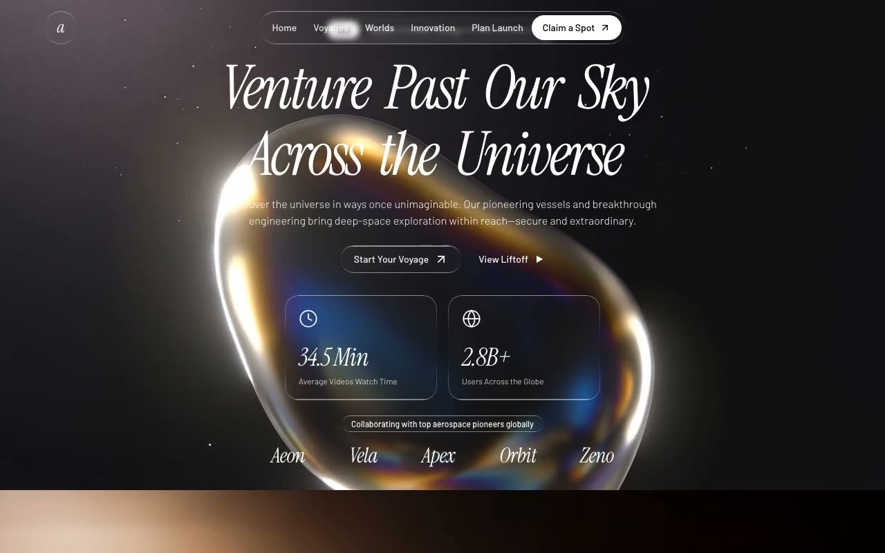

# Astra — Cinematic Space-Travel Landing Page (React + Framer Motion + Liquid Glass)

[](./demo.mp4)

A single-page space-travel landing site for "astra", with two full-height sections — a hero and a capabilities showcase — both layered over looping background videos that crossfade via a custom rAF-driven JavaScript routine (no CSS transitions). The page shares a "liquid glass" design system for all chrome (nav, chips, cards, CTAs); all text is white over full-bleed video with no dark overlay, so contrast comes entirely from the glass chrome. Generated with Claude Fable 5.

The app runs entirely in the browser with no bundler: React 18.3.1 (UMD), Babel Standalone for in-browser JSX, and Framer Motion (UMD) are loaded from CDN, with Tailwind via its CDN script and an inline config. Components are `text/babel` scripts under `js/` that export onto `window`. Notable techniques: the custom `FadingVideo` rAF crossfade (manual looping via the `ended` event), an IntersectionObserver word-by-word blur-in headline, and liquid-glass gradient borders via masked `::before` pseudo-elements. Background videos are vendored locally under `assets/`.

## Run

This is a static project — open `index.html` in a browser, or serve the folder:

```sh
python3 -m http.server 8000
```

> Note: the CDN scripts (React, Babel, Framer Motion, Tailwind) require a network connection at runtime, though the videos and component files are local.

See `prompt.md` for the full build spec; `demo.mp4` shows it in motion.

---

Part of the [Landing pages](../) collection in the [claude-directory](../../) — an open-source gallery of AI-generated UI built with Claude Fable 5. [Browse the live gallery](https://pulkitxm.com/claude-directory).
