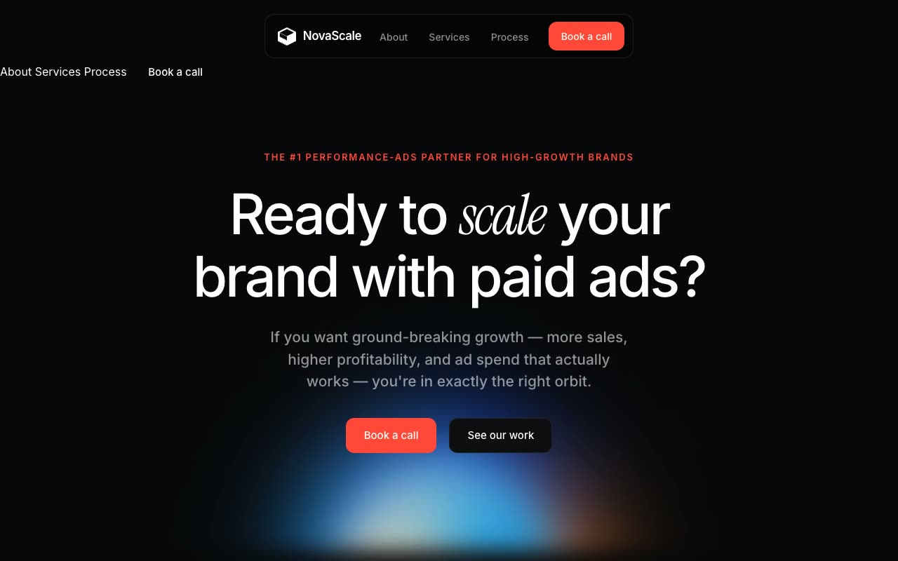

# Spectral Orbit — NovaScale Paid-Ads Agency Landing Page (Vanilla HTML + CSS + JS)

[](./demo.mp4)

**Spectral Orbit** is a full, multi-section dark landing page for NovaScale, a fictional paid-advertising growth agency. The design language is a near-black, cosmic, performance-marketing aesthetic built around slowly rotating chromatic conic-gradient nebula orbs that bloom behind crisp, minimal content — a single electric coral-red accent cutting through an otherwise monochrome void, with italic Instrument Serif emphasis punctuating a tight Inter sans-serif system. The result is a premium, kinetic marketing landing page ideal for performance agencies, growth studios, and digital advertising brands. Generated with Claude Fable 5.

A single self-contained static build — no framework, no build step required — the page runs through a floating pill nav, a full-viewport hero with stacked counter-rotating orbs, a trust marquee, an auto-scrolling testimonials carousel, about/mission, services, an "other agencies vs NovaScale" comparison, a 3-step process, a results/stats CTA, an FAQ accordion, a final CTA, and footer. Motion comes from continuous CSS rotate loops, JS-duplicated infinite marquees, IntersectionObserver fade-up reveals, hover lifts, and a slide-down mobile nav — all respecting `prefers-reduced-motion`. All fonts and imagery are self-hosted locally so it runs fully offline.

## Run

This is a static project — open `index.html` in a browser, or serve the folder:

```sh
python3 -m http.server 8000
```

See `prompt.md` for the full build spec; `demo.mp4` shows it in motion.

---

Part of the [Landing pages](../) collection in the [claude-directory](../../) — an open-source gallery of AI-generated UI built with Claude Fable 5. [Browse the live gallery](https://pulkitxm.com/claude-directory).
