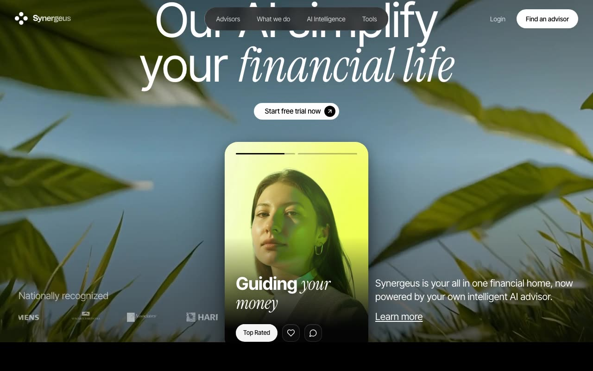

# Synergeus — AI Fintech Landing Page (React 18 + Vite + TypeScript + Tailwind CSS)

[](./demo.mp4)

**Synergeus** is a pixel-faithful dark, cinematic marketing landing page for an AI-powered personal finance platform. The page is composed of three scroll-revealed sections — a video hero, an analytics showcase, and an AI intelligence feature grid — with meticulous attention to typography, motion timing, glass surfaces, and SVG construction. A striking fintech UI landing page suited to AI advisor, wealth management, and financial SaaS products. Generated with Claude Fable 5.

## Tech stack

- **React 18** + **Vite** + **TypeScript**
- **Tailwind CSS v3** (`font-heading`/`font-sans` → Inter Tight, `font-serif` → Instrument Serif)
- **framer-motion** — entry reveals, blur-ins, 3D tilt, count-ups, path draws
- **hls.js** — hero background video playback (with native-Safari + MP4 fallbacks)
- **lucide-react** — icons
- **react-router-dom** — page routing (single Index view)

## Sections

1. **Hero** — HLS/MP4 video background, glass pill navbar, large display headline
   (Inter Tight + Instrument Serif italic), a 3D mouse-tilted "story card" with
   looping progress bars and alternating headlines, an auto-scrolling logo
   marquee, and supporting copy.
2. **Analytics** — scroll-triggered blur-in heading, a glass "Monthly overview"
   card with a `$100 → $14,250` cubic-ease count-up and static category bars, and
   a transaction card with a `$10 → $925` count-up, portrait, and brand pill.
3. **AI Intelligence** — three equal cards:
   - *Natural Language Queries* — glass UI with a rotating question/answer block.
   - *Predictive Analysis* — a clip-path wipe-reveal area chart with a floating
     green dot + connector.
   - *Smart Categorization* — a measured node tree drawn with `useLayoutEffect`,
     animated S-curve connectors, and native SVG `animateMotion`/`mpath` traveling
     glow dots that loop forever.

## Assets

Every asset is **vendored locally** under `public/assets/` so the project runs
fully offline:

- `hero.mp4` — the hero background video, transcoded locally from the original
  Mux HLS stream (`stream.mux.com/…m3u8`). The HLS source + hls.js playback path
  is retained in `HeroVideo.tsx` as a progressive enhancement.
- `Logo-lov.svg`, `logo-{taa,harris,siemens,summit}.png` — brand + marquee logos.
- `person-1.png`, `person-2.png` — portraits.
- `block-1.png`, `block-2.png` — Section 2 card backgrounds.
- `back-3-{1,2,3}.png` — Section 3 card backgrounds.

## Run

```bash
npm install
npm run dev      # http://localhost:5173
npm run build    # type-check + production bundle
```

---

Part of the [Landing pages](../) collection in the [claude-directory](../../) — an open-source gallery of AI-generated UI built with Claude Fable 5. [Browse the live gallery](https://pulkitxm.com/claude-directory).
