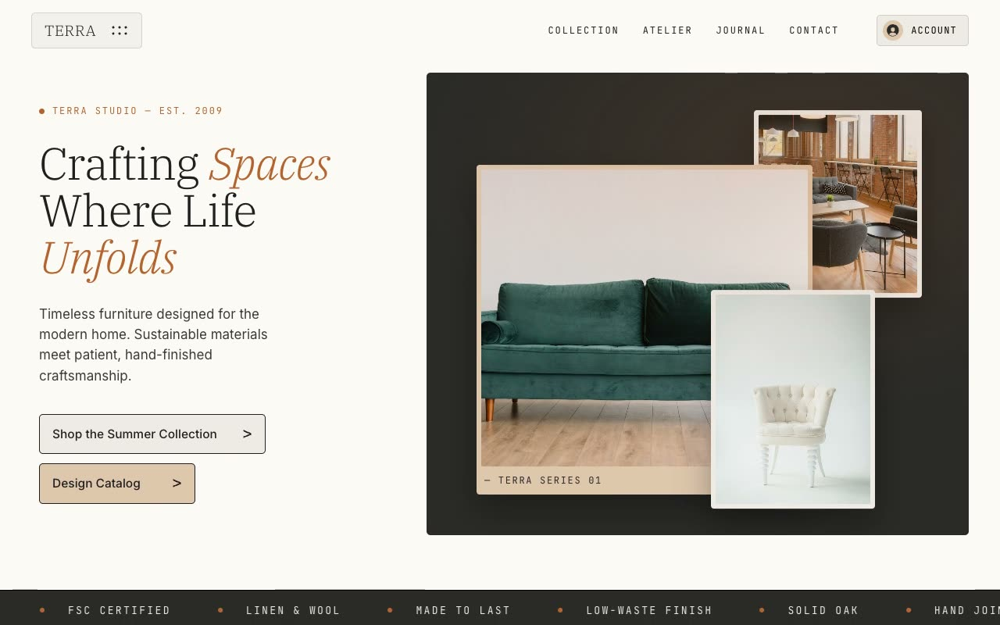

# Terra Studio — Quiet Craft Editorial Landing Page (Vanilla HTML + CSS + JS)

[](./demo.mp4)

**Terra Studio** is a full, multi-section editorial landing page for a fictional artisan furniture and interior-design house ("Crafting spaces where life unfolds"). The "Quiet Craft Editorial" design language is a warm, gallery-like, paper-stock aesthetic that reads like a printed monograph about modern furniture — calm, tactile, and expensive, with flat matte surfaces, square corners, hairline ink rules, and timeless pieces shot in sunlit rooms anchored by ink-black IBM Plex Serif type punctuated by terracotta and oak tones. An ideal landing page for furniture studios, interior design brands, and artisan home goods. Generated with Claude Fable 5.

The layout moves through a sticky transparent header, a two-column hero with three overlapping framed image cards over a charcoal panel, an infinite mono marquee strip, a collection grid, a philosophy/craft split, a count-up stats band, a newsletter CTA, and a charcoal footer. Type pairs IBM Plex Serif display headings (with italic emphasis) against JetBrains Mono uppercase labels and a clean grotesque sans body. Motion is restrained: staggered load-in, mouse-move card parallax, IntersectionObserver reveals, a seamless marquee, and scroll-triggered count-ups — all respecting `prefers-reduced-motion`. A single self-contained static site with all fonts (WOFF2) and imagery vendored locally, running offline with no build step.

## Run

This is a static project — open `index.html` in a browser, or serve the folder:

```sh
python3 -m http.server 8000
```

See `prompt.md` for the full build spec; `demo.mp4` shows it in motion.

---

Part of the [Landing pages](../) collection in the [claude-directory](../../) — an open-source gallery of AI-generated UI built with Claude Fable 5. [Browse the live gallery](https://pulkitxm.com/claude-directory).
