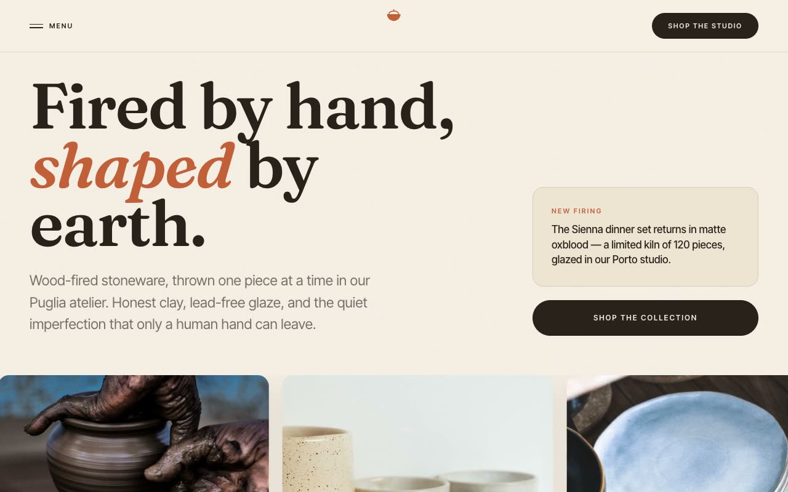

# Terra Siena — Handcrafted Ceramics Atelier Landing Page (Vanilla HTML + Tailwind CSS + JS)

[](./demo.mp4)

**Terra Siena** is a full, multi-section editorial landing page for a fictional ceramics studio. The "Sun-Fired Earth" aesthetic is a warm, artisanal e-commerce page that feels like a printed craft catalog — hand-thrown stoneware, kiln smoke, raw clay, and Mediterranean light — with generous negative space, large editorial serif display type, earthen terracotta/ochre/bone-cream tones, subtle paper grain, and arch motifs echoing kiln openings. A distinctive artisan brand landing page suited to ceramics studios, craft ateliers, and handmade goods boutiques. Generated with Claude Fable 5.

The layout runs through a fixed translucent header with a fullscreen overlay menu, a split editorial hero with a full-bleed pottery image marquee, a brand-values strip, a collections deck of portrait cards that begin fanned and spread horizontally on scroll, a 12-column testimonial/atmosphere grid, a "Why Terra Siena" section of 3D flip cards, an FAQ accordion, a final CTA, and a dark-clay footer with its own craft-claim marquee. Motion includes word-by-word text reveals, IntersectionObserver fade-and-rise, seamless marquee loops, the one-shot deck spread, `rotateY` flip cards (tap-to-flip on touch), and single-open accordions. Self-contained plain HTML + Tailwind + vanilla JS, with all fonts, icons, and imagery vendored locally so it runs fully offline with no build step.

## Run

This is a static project — open `index.html` in a browser, or serve the folder:

```sh
python3 -m http.server 8000
```

See `prompt.md` for the full build spec; `demo.mp4` shows it in motion.

---

Part of the [Landing pages](../) collection in the [claude-directory](../../) — an open-source gallery of AI-generated UI built with Claude Fable 5. [Browse the live gallery](https://pulkitxm.com/claude-directory).
