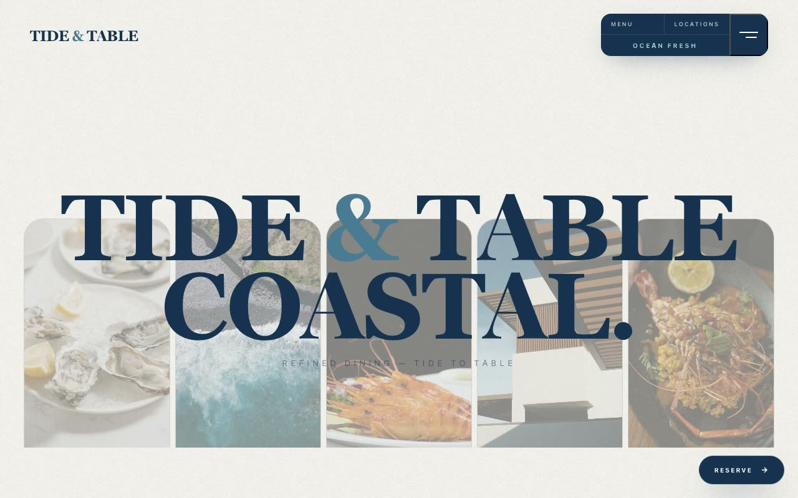

# Tide & Table — Coastal Seafood & Oyster Bar Landing Page (Vanilla HTML + CSS + JS)

[](./demo.mp4)

**Tide & Table** is a refined, editorial landing page for a fictional high-end coastal seafood and oyster bar. The mood is quiet luxury meets Atlantic maritime — bright, airy, salt-washed, with deep-navy ink on a clean off-white page, art-directed like a Michelin-level restaurant magazine spread. High-contrast uppercase serif headlines against a tight grotesque sans, with a fine grain overlay for tactile print feel — an ideal restaurant landing page for upscale dining, coastal cuisine, and seasonal seafood brands. Generated with Claude Fable 5.

The layout runs through a sticky top bar with a navy status-panel pill, a 90vh hero of five rhythmic vertical image strips (desaturated into the navy tint) that stagger-reveal upward on load beneath a giant serif headline, a two-column philosophy block with a Ken-Burns image, an interactive navy seasonal-harvest menu where hovering a row floats a rotated image card, an editorial atmosphere overlap, an architectural split reservation card with an inline-confirming form, a navy footer, a floating "Reserve" pill, and a full-screen menu overlay. Motion includes the staggered strip rise, IntersectionObserver fade-and-rise, the menu hover interaction, the slow Ken-Burns pan, and micro hover transitions — all respecting `prefers-reduced-motion`. Self-contained vanilla HTML + CSS + a little JS, with all fonts, imagery, and the noise texture vendored locally via relative paths so it runs fully offline with no build step.

## Run

This is a static project — open `index.html` in a browser, or serve the folder:

```sh
python3 -m http.server 8000
```

See `prompt.md` for the full build spec; `demo.mp4` shows it in motion.

---

Part of the [Landing pages](../) collection in the [claude-directory](../../) — an open-source gallery of AI-generated UI built with Claude Fable 5. [Browse the live gallery](https://pulkitxm.com/claude-directory).
