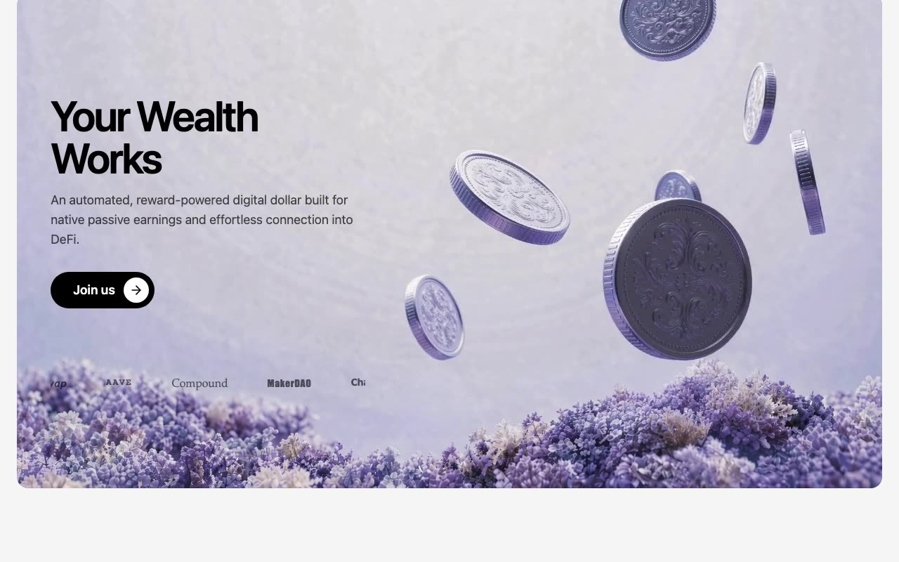

# USD Halo — Reward-Earning Stablecoin Landing Page (React + TypeScript + Vite + Tailwind CSS)

[](./demo.mp4)

**USD Halo** is a premium fintech-style landing page for a reward-earning stablecoin product. The design is dark and editorial, with a full-viewport video hero, animated brand marquees, and a structured feature grid — a polished crypto/DeFi marketing landing page suitable for stablecoin launches, Web3 wallets, and fintech products. Generated with Claude Fable 5.

## Sections

1. **Navbar** — transparent, absolutely positioned over the hero; custom
   interlocking-squares `LogoIcon`, center links, "Open Wallet" pill.
2. **Hero** — full-viewport video card with "Your Wealth Works" headline,
   "Join us" pill + arrow circle, and a seamless 22s brand marquee.
3. **Info ("Meet USD Halo.")** — intro grid plus a 4-column card row
   (image card spanning 2 columns + two `#2B2644` cards).
4. **Backed By** — 30s investor marquee beside a lead-in line.
5. **Use Cases** — "Use modes" copy beside a 720px video card ("Commerce").

Typography is TT Norms Pro (400/600) via `@font-face` with `font-display:
swap`; see `public/fonts/README.md` for supplying the licensed files.
`font-medium` is remapped to weight 600 so it is the heaviest weight on the
page, and all headings use tight negative letter-spacing.

## Commands

```bash
npm install
npm run dev      # local dev server
npm run build    # type-check + production build
npm run verify   # headless Chromium checks against the production build
```

---

Part of the [Landing pages](../) collection in the [claude-directory](../../) — an open-source gallery of AI-generated UI built with Claude Fable 5. [Browse the live gallery](https://pulkitxm.com/claude-directory).
