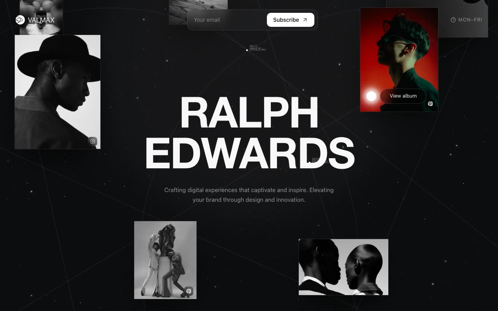

# Valmax — Ralph Edwards Cinematic Photography Studio Landing Page (TanStack Start + React 19 + Tailwind v4 + Framer Motion)

[](./demo.mp4)

**Valmax** is a single-page React landing site for the fictional cinematic photography studio of Ralph Edwards. The site is permanently dark (OKLCH near-black with a lime selection accent) and opens with a ~3.6s `IntroSequence` — concentric circles, radiating rays, and a clip-revealed wordmark that flies into the topbar slot — before the rest of the page animates in. A visually striking photography portfolio landing page suited to creative studios, cinematographers, and visual artists. Generated with Claude Fable 5.

Sections (RalphHero, OurPhotographer, AllTypes, MechanicalMarvels, Footer) are layered over a canvas `Starfield` (with an optional constellation ring) and an SVG `LineField` of animated lines and monospace star markers, with floating photo collages, pointer parallax, and a scroll-driven parallax background. Motion is orchestrated via shared blur-in / photo-in variants and a 2.9s intro delay; `prefers-reduced-motion` shortens the intro and disables hero parallax. Image assets have graceful fallbacks (placeholder divs, text wordmark, omitted decoratives).

## Run

```sh
npm install
npm run dev      # custom dev server (scripts/dev.mjs)
npm run dev:hmr  # vite dev with HMR
npm run build    # vite build
npm run serve    # preview the build
npm run lint     # tsc --noEmit
```

See `prompt.md` for the full build spec; `demo.mp4` shows it in motion.

---

Part of the [Landing pages](../) collection in the [claude-directory](../../) — an open-source gallery of AI-generated UI built with Claude Fable 5. [Browse the live gallery](https://pulkitxm.com/claude-directory).
