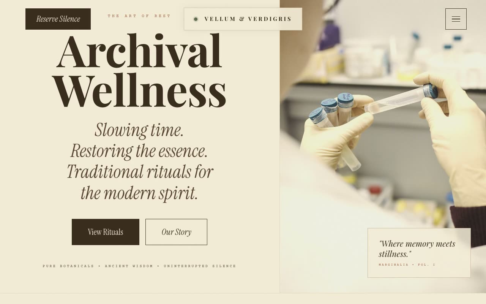

# Vellum & Verdigris — Archival Apothecary Wellness Landing Page (Vanilla HTML/CSS/JS)

[](./demo.mp4)

A multi-section landing page for **Vellum & Verdigris**, a fictional high-end wellness sanctuary and apothecary, built with a vintage editorial aesthetic called "Archival Apothecary." The page feels like a leather-bound museum catalogue: aged sepia paper, pressed botanical motifs, ink stamps, catalogue codes, and hairline rules throughout — part luxury wellness landing page, part printed ledger. Typography pairs oversized Playfair Display display serifs, italic Instrument Serif pull-quotes, and Courier Prime monospace catalogue labels, all locally vendored. Generated with Claude Fable 5.

Sections include a fixed transparent header with a centered logo plate, a full-height two-column hero with a cream-overlay image reveal, a "Volume I" numbered-principles philosophy grid, a signature-rituals portrait gallery with catalogue-code stamps, a split sanctuary editorial, an ink-background memoirs/testimonials band, a booking CTA with underline-style form fields, and a four-column footer. A low-opacity SVG fractal-turbulence paper-grain overlay sits above the page; all photography is treated with a sepia, low-contrast filter.

Motion includes staggered hero text entrances, an image reveal where a cream overlay slides up while the photo zooms out, `IntersectionObserver` scroll reveals with animated hairline under-rules, slow image zooms and italicizing titles on hover, and a hollow ink ring custom cursor on pointer-fine devices. Everything respects `prefers-reduced-motion`, and the build is vanilla HTML/CSS/JS with semantic landmarks, labelled fields, and a keyboard-operable menu.

## Run

This is a static project — open `index.html` in a browser, or serve the folder:

```sh
python3 -m http.server 8000
```

See `prompt.md` for the full build spec; `demo.mp4` shows it in motion.

---

Part of the [Landing pages](../) collection in the [claude-directory](../../) — an open-source gallery of AI-generated UI built with Claude Fable 5. [Browse the live gallery](https://pulkitxm.com/claude-directory).
