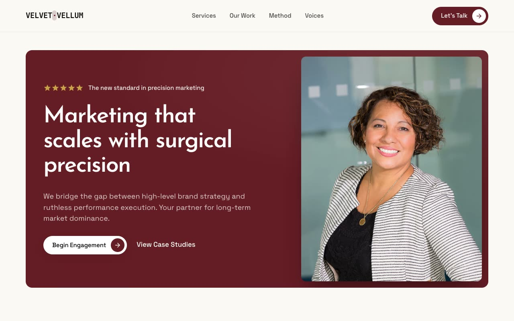

# Velvet Vellum — Precision Marketing Agency Landing Page (Vanilla HTML/CSS/JS)

[](./demo.mp4)

A fully responsive, multi-section marketing agency landing page for **Velvet Vellum**, a fictional precision marketing consultancy, built in the "Velvet Precision" design language. The mood is quiet luxury meets surgical rigor: a warm near-white paper canvas (`#FBF9F6`) punctuated by deep oxblood/maroon (`#651C24`) panels, generous negative space, oversized editorial display type, and precise, restrained micro-interactions — a high-end consultancy prospectus, never playful or generic. Typography pairs geometric-elegant Josefin Sans for headlines with Space Grotesk body copy and a monospace family for the wordmark, footer labels, and uppercase eyebrows, all locally vendored. Generated with Claude Fable 5.

Sections run through a fixed translucent navbar, a maroon-panel hero with a star eyebrow row and a logo marquee below, a "Future of Growth" services split with a filled maroon middle card, a featured-work bento grid, a maroon method-and-stats panel with glassy stat tiles, an auto-rotating testimonial slider, a final CTA, and a footer that closes on a dramatic faux-3D perspective floor grid with a giant stroked "VELLUM" wordmark mask-faded into the floor.

Motion is driven by an `IntersectionObserver` for staggered fade-and-rise reveals, a seamless infinite logo marquee with edge mask-fade, springy button arrow badges, grayscale-to-color hover on the center work image, a JS auto-rotating testimonial with a morphing active pagination dot, and a pulsing "growth engine active" status dot. All transform-heavy motion respects `prefers-reduced-motion`, and the build is vanilla HTML/CSS/JS with semantic landmarks and keyboard-focusable controls.

## Run

This is a static project — open `index.html` in a browser, or serve the folder:

```sh
python3 -m http.server 8000
```

See `prompt.md` for the full build spec; `demo.mp4` shows it in motion.

---

Part of the [Landing pages](../) collection in the [claude-directory](../../) — an open-source gallery of AI-generated UI built with Claude Fable 5. [Browse the live gallery](https://pulkitxm.com/claude-directory).
