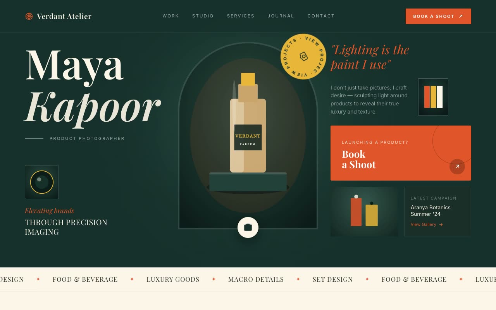

# Verdant Atelier — Product-Photography Studio Landing Page (Vanilla HTML/CSS/JS)

[](./demo.mp4)

A refined editorial single-page landing site for **Verdant Atelier**, a fictional high-end product-photography studio headed by photographer persona Maya Kapoor, styled in the "Forest & Gold" aesthetic. A deep moody forest-green canvas (`#16302B`) pairs with warm parchment cream, museum gold, and a charged deep-orange accent — part luxury editorial magazine, part boutique darkroom. The signature motif is the **arch**: images masked into tall rounded-top "cathedral arch" shapes evoking a gallery and camera aperture at once. Display type is a high-contrast transitional serif (Playfair-like) over a neutral grotesk body sans, all locally vendored. Generated with Claude Fable 5.

Sections move top-to-bottom through a blurred fixed navbar, an asymmetric 12-column editorial hero (featuring a slowly rotating gold "View · Projects" circular badge with text on a path), infinite marquees, a cream studio/about section, a staggered three-column work gallery, arch-masked service cards with varied shapes, gallery highlights with grayscale-to-color hover, and a testimonial/philosophy footer.

Motion is subtle and tactile: `IntersectionObserver` scroll-reveal fade-ups, two-plus seamless infinite marquees, hover image scale-ups, grayscale-to-color gallery thumbnail transitions, and a pulsing ring behind the "Load More" button — all respecting `prefers-reduced-motion`. All fonts, photos, and locally generated SVG still-life artwork are vendored locally for offline use.

## Run

This is a static project — open `index.html` in a browser, or serve the folder:

```sh
python3 -m http.server 8000
```

See `prompt.md` for the full build spec; `demo.mp4` shows it in motion.

---

Part of the [Landing pages](../) collection in the [claude-directory](../../) — an open-source gallery of AI-generated UI built with Claude Fable 5. [Browse the live gallery](https://pulkitxm.com/claude-directory).
