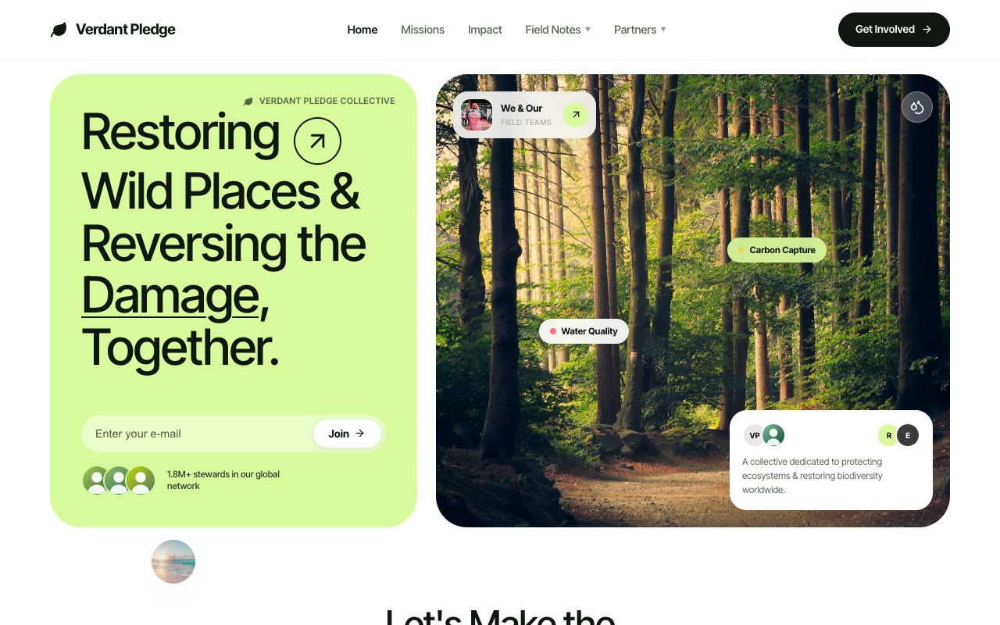

# Verdant Pledge — Regenerative Conservation Bento Landing Page (Vanilla HTML/CSS/JS)

[](./demo.mp4)

A full landing page for **Verdant Pledge**, a fictional environmental conservation collective, styled in the "Soft Editorial Bento" aesthetic. The page is a light, airy eco-brand built entirely from large, generously-rounded bento cards (40 px radius) floating on a white canvas, with a single electric lime-green accent (`#D9F99D`) used sparingly. The mood is calm, trustworthy, and modern-non-profit — nature photography meets clean product-design UI. Type is a single family, Inter Tight, with a consistent radius and spacing scale and soft layered shadows throughout. Generated with Claude Fable 5.

Sections flow through a sticky blurred nav, a two-card bento hero (lime copy card plus full-bleed nature photo with floating glass UI overlays), a centered mission statement, a "WE RESTORE → EARTH" wordmark strip, an editorial missions table with hover image previews, a 4-up grid of problem image cards, a dark contrast impact band with count-up stats, native `<details>` FAQ accordions, and a newsletter footer.

Interactions are driven by vanilla JS and inline SVG: staggered `IntersectionObserver` scroll-reveals, a continuously pulsing amber map dot, stat numbers that count up when the impact band enters view, hover previews on table rows, scaling problem images, a nudging wordmark arrow, FAQ plus icons that rotate 45° and turn lime, and a slide/fade mobile menu — all honoring `prefers-reduced-motion`. All fonts, photos, avatars, and textures are vendored locally for offline use.

## Run

This is a static project — open `index.html` in a browser, or serve the folder:

```sh
python3 -m http.server 8000
```

See `prompt.md` for the full build spec; `demo.mp4` shows it in motion.

---

Part of the [Landing pages](../) collection in the [claude-directory](../../) — an open-source gallery of AI-generated UI built with Claude Fable 5. [Browse the live gallery](https://pulkitxm.com/claude-directory).
