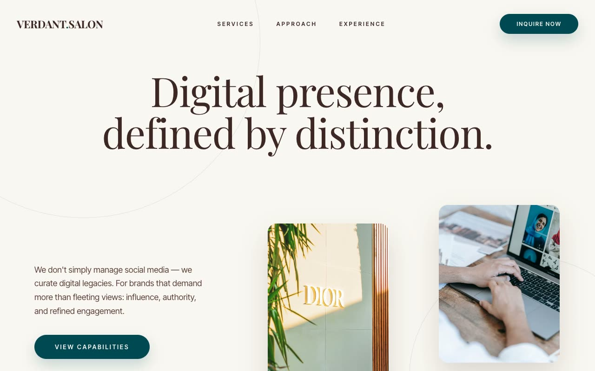

# Verdant Salon — Luxury Social-Strategy Agency Landing Page (Vanilla HTML/CSS/JS)

[](./demo.mp4)

A fully responsive, multi-section marketing landing page for **Verdant Salon**, a fictional elite social-media and digital-presence agency, built in the "Heritage Verdant" design language. The aesthetic is quiet old-money editorial luxury: a warm paper-beige canvas (`#F9F7F2`), deep midnight-green panels (`#004953`), and cocoa-brown ink for type — less a SaaS storefront, more a printed prospectus from a Mayfair consultancy. Headings use Playfair Display (with occasional italic) over Inter Tight body and wide-tracked uppercase eyebrows, all locally vendored. Generated with Claude Fable 5.

The page moves through a transparent header that gains a blurred beige backdrop on scroll, a full-viewport hero with staggered portrait image cards, an impact/stats block, full-width service rows on a warmer beige panel, an alternating heritage case-study gallery, a midnight-green contact section with a faked client-side inquiry form, and a deep-cocoa footer. The signature motion is a **grid demask** reveal: image cards uncover via a grid of beige tiles that each fade and scale away on staggered delays.

Alongside the demask are `IntersectionObserver` scroll reveals with cubic-bezier easing and staggered children, stat count-ups, scroll-state header transitions, smooth-scroll anchors, floating service-row preview cards, and gallery zoom-on-hover — all respecting `prefers-reduced-motion`. Hand-written CSS, a small vanilla-JS file, and locally vendored fonts and photography keep it self-contained and offline-runnable.

## Run

This is a static project — open `index.html` in a browser, or serve the folder:

```sh
python3 -m http.server 8000
```

See `prompt.md` for the full build spec; `demo.mp4` shows it in motion.

---

Part of the [Landing pages](../) collection in the [claude-directory](../../) — an open-source gallery of AI-generated UI built with Claude Fable 5. [Browse the live gallery](https://pulkitxm.com/claude-directory).
