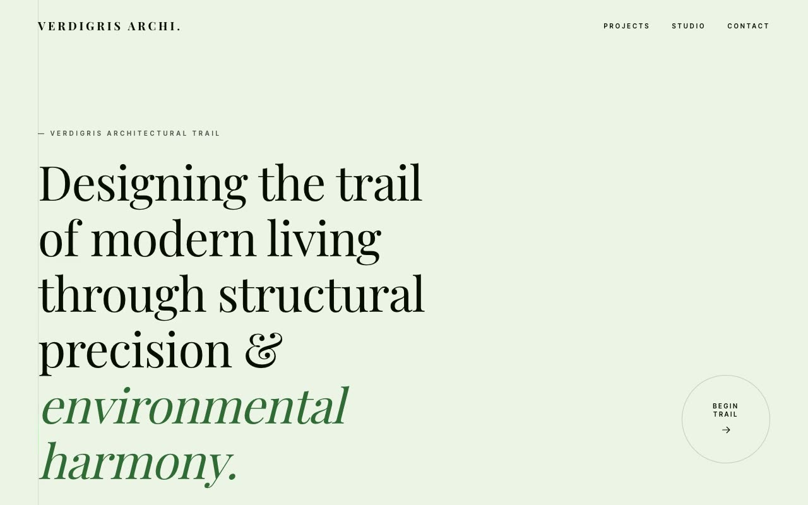

# Verdigris Trail — Architecture Studio Landing Page (Vanilla HTML/CSS/JS, Playfair Display)

[](./demo.mp4)

A quiet, gallery-like editorial landing page for **Verdigris Archi.**, a fictional high-end architecture studio, styled in the "Architectural Trail" design language — a printed-monograph feel set on a soft fennel-pastel canvas (`#ECF3E5`), with ink-dark Playfair Display serif type punctuated by a single luminous mint accent (`#A5FFA9`). The whole page is threaded by a literal "trail": a faint hairline running down the left margin with a glowing mint comet looping top-to-bottom, and each major section numbered as a "trail entry." Typography pairs Playfair Display (serif) for display and Inter Tight (sans) for body and labels, both locally vendored. Generated with Claude Fable 5.

Sections move from a transparent fixed header and a left-weighted serif hero with a circular "Begin Trail" CTA, through a scrolling pillar marquee (sustainable form, urban integration, material integrity, spatial narrative), a grayscale-to-color brutalist hero image with a fennel pull-quote overlay, numbered principle cards, a staggered two-column projects gallery, an ink-dark stats band, and a closing contact CTA with footer link columns.

Motion is restrained and deliberate: the ~8s eased comet loop along the left trail hairline, a seamless duplicated-track marquee that pauses on hover, `IntersectionObserver` scroll reveals, and grayscale-to-color image hovers — all gated behind `prefers-reduced-motion`. The build is plain vanilla HTML/CSS/JS with all assets vendored locally for offline use.

## Run

This is a static project — open `index.html` in a browser, or serve the folder:

```sh
python3 -m http.server 8000
```

See `prompt.md` for the full build spec; `demo.mp4` shows it in motion.

---

Part of the [Landing pages](../) collection in the [claude-directory](../../) — an open-source gallery of AI-generated UI built with Claude Fable 5. [Browse the live gallery](https://pulkitxm.com/claude-directory).
