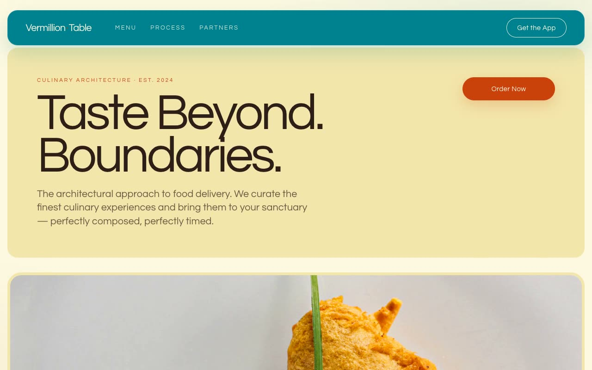

# Vermillion Table — Premium Food-Delivery Landing Page (HTML + CSS + Vanilla JS)

[](./demo.mp4)

A warm, editorial landing page for **Vermillion Table**, a fictional high-end food-delivery service ("Taste Beyond Boundaries"). The aesthetic identity is "Culinary Architecture" — food delivery treated as a design object, with pale vanilla-paper backgrounds, rounded modular "island" cards, oversized ultra-tight display type in Questrial, and a confident red-orange / deep-teal duotone. The feel is a neighborhood atelier menu crossed with a Swiss design magazine — appetizing and trustworthy, never glossy-corporate or generic-SaaS. Generated with Claude Fable 5.

Every section is a rounded island floating on the vanilla canvas: a deep-teal sticky header, a stacked hero of a text island plus a full-bleed plating-photo island with a floating frosted "Dish of the Week" card, a three-up category grid, the "Logistics of Luxury" four-phase process, an app-download split with a bobbing phone mockup, a partner island, and a red-orange footer. Built with vanilla HTML, CSS, and JS.

Motion is soft and purposeful: one-shot IntersectionObserver scroll reveals, a gently floating phone mockup, category cards that zoom and shift their overlay tint teal-to-red-orange on hover, fast button feedback, and header-offset smooth anchor scrolling — all honoring `prefers-reduced-motion`.

## Run

This is a static project — open `index.html` in a browser, or serve the folder:

```sh
python3 -m http.server 8000
```

See `prompt.md` for the full build spec; `demo.mp4` shows it in motion.

---

Part of the [Landing pages](../) collection in the [claude-directory](../../) — an open-source gallery of AI-generated UI built with Claude Fable 5. [Browse the live gallery](https://pulkitxm.com/claude-directory).
