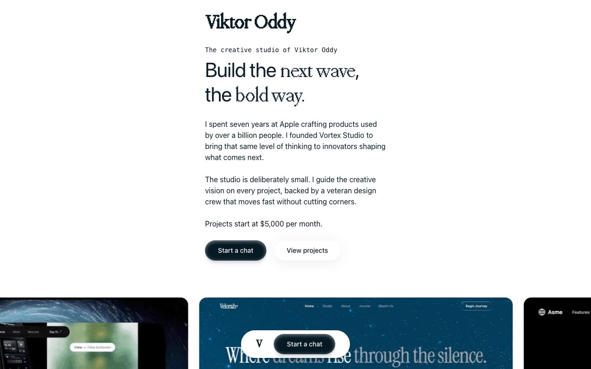

# Viktor Oddy — Creative Studio Landing Page (React + TypeScript + Vite + Tailwind CSS)

[](./demo.mp4)

Single-page landing for the fictional creative design studio **Viktor Oddy**, built with React + TypeScript + Vite + Tailwind CSS and lucide-react icons. The design is minimal white-background throughout, pairing **PP Neue Montreal** (body, Webflow CDN) with **PP Mondwest** (serif accent, served locally from `/PPMondwest-Regular.woff2`). Staggered IntersectionObserver scroll reveals, an infinite image marquee, a parallax testimonial portrait, pricing cards, an auto-scrolling testimonial carousel, a project showcase, and a cursor-trail GIF CTA make up the full interactive experience. Generated with Claude Fable 5.

## Sections

1. Hero (narrow centered column, staggered fade-in-up reveals)
2. Infinite GIF marquee (30s desktop / 10s mobile loop)
3. Testimonial quote with scroll parallax portrait
4. Pricing cards (dark Monthly Partnership / light Custom Project)
5. Auto-scrolling testimonial carousel (3s autoplay, hover pause, infinite via tripled list)
6. Project showcase (per-item IntersectionObserver reveals)
7. "Partner with us" CTA with cursor-trail GIF thumbnails
8. Footer, copyright bar, fixed floating bottom nav

## Run

```sh
npm install
npm run dev      # dev server
npm run build    # type-check + production build
npm run preview  # serve dist/
```

---

Part of the [Landing pages](../) collection in the [claude-directory](../../) — an open-source gallery of AI-generated UI built with Claude Fable 5. [Browse the live gallery](https://pulkitxm.com/claude-directory).
