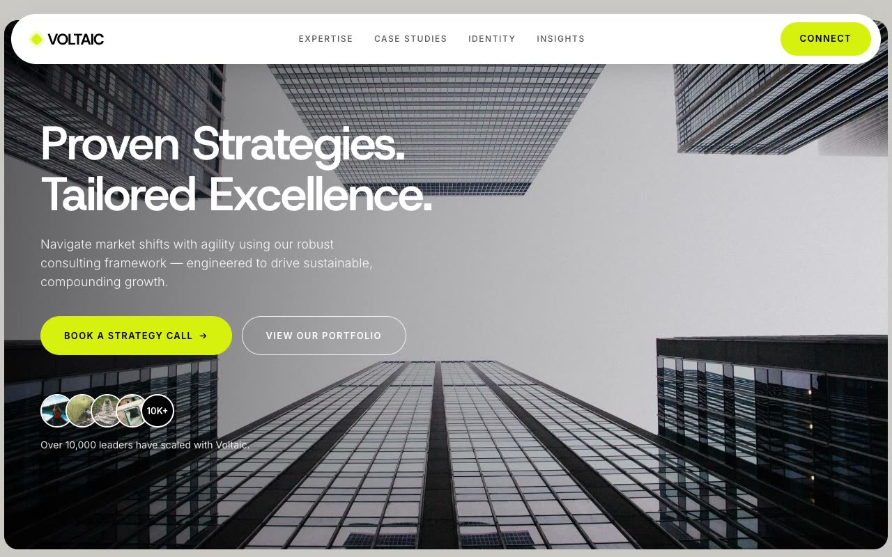

# Voltaic — "Putty & Voltage" Strategic Advisory Landing Page (HTML + CSS + Vanilla JS)

[](./demo.mp4)

A composed, premium landing page for **Voltaic Advisory**, a fictional high-end strategy consultancy. The design language is "Putty & Voltage" — a warm putty-grey canvas (`#CBC9C6`), generously rounded tile architecture, a neutral grotesque display face (Host Grotesk over Inter), and one decisive electric-lime accent (`#D8F010`) that does all the emotional work. Each major section is a single rounded panel floating on the putty background, alternating white, warm off-white, and soft pastel fills (lavender, yellow, pink, mint). The mood is composed, confident, and premium: calm Swiss restraint punctuated by voltage-lime. Built with vanilla HTML, CSS, and JS. Generated with Claude Fable 5.

The page stacks a floating pill nav, a full-bleed golden-hour hero with social-proof avatars, a stats/intro tile, a commitment panel, a sticky service-card stack, a testimonial tile, an expanding case-studies list, an insights marquee, a lime final-CTA tile, and a near-black footer.

The signature interaction is the sticky services stack — pastel cards pinned at an offset so each slides up and stacks over the previous as you scroll. It joins IntersectionObserver fade-and-rise reveals, an edge-masked insights ticker looping seamlessly, rotating portfolio arrow chips, and hover-inverting buttons, with `prefers-reduced-motion` respected for the ticker and reveals.

## Run

This is a static project — open `index.html` in a browser, or serve the folder:

```sh
python3 -m http.server 8000
```

See `prompt.md` for the full build spec; `demo.mp4` shows it in motion.

---

Part of the [Landing pages](../) collection in the [claude-directory](../../) — an open-source gallery of AI-generated UI built with Claude Fable 5. [Browse the live gallery](https://pulkitxm.com/claude-directory).
