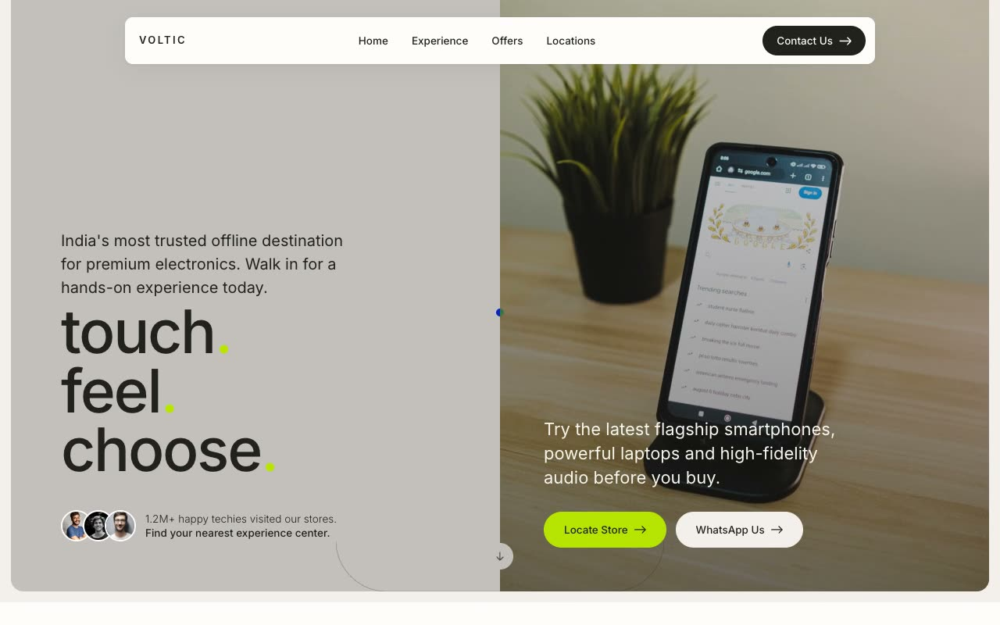

# Voltic Showroom — Premium Offline Electronics Experience Center Landing Page (HTML + CSS + Vanilla JS)

[](./demo.mp4)

A single-page, forced-light marketing landing page for **Voltic**, a fictional Indian chain of walk-in "experience centers" where people touch, feel, and demo flagship phones, laptops, audio, and cameras before they buy. The aesthetic identity is "Electric Stone" — a quiet, editorial, gallery-like warm-neutral canvas punctuated by a single high-voltage electric-lime accent (`rgb(182, 228, 2)`). The mood is calm, tactile, and retail-premium: near-black ink on warm stone, with lime used only as punctuation — terminal dots on headlines, eyebrow dots, the primary CTA, and check icons. Typography is a single vendored **Inter** family with tight-tracked display headlines and wide-tracked uppercase eyebrows. Generated with Claude Fable 5.

The layout moves through a floating pill navbar, a full-viewport split hero (greige text half with the stacked `Touch. / Feel. / Choose.` headline beside a full-bleed store photo), an infinite auto-scrolling demo marquee of product cards, a responsive curated-zones tile grid, an interactive accordion that cross-fades a paired image, a pricing-style "offline perks" deals row with a featured ink card, an ink CTA band, and an ink footer. Built with plain HTML, CSS, and Vanilla JS.

Interaction details carry the gallery-grade feel: a reveal-on-scroll IntersectionObserver with a soft cubic-bezier ease and staggered delays, a small lime custom cursor on desktop, a marquee that pauses on hover, accordion max-height animation with image cross-fade, and a transform-driven mobile overlay menu. All fonts, photography, product images, and avatars are vendored locally with icons and the curved scroll graphic recreated as inline SVG, so the page runs fully offline.

## Run

This is a static project — open `index.html` in a browser, or serve the folder:

```sh
python3 -m http.server 8000
```

See `prompt.md` for the full build spec; `demo.mp4` shows it in motion.

---

Part of the [Landing pages](../) collection in the [claude-directory](../../) — an open-source gallery of AI-generated UI built with Claude Fable 5. [Browse the live gallery](https://pulkitxm.com/claude-directory).
