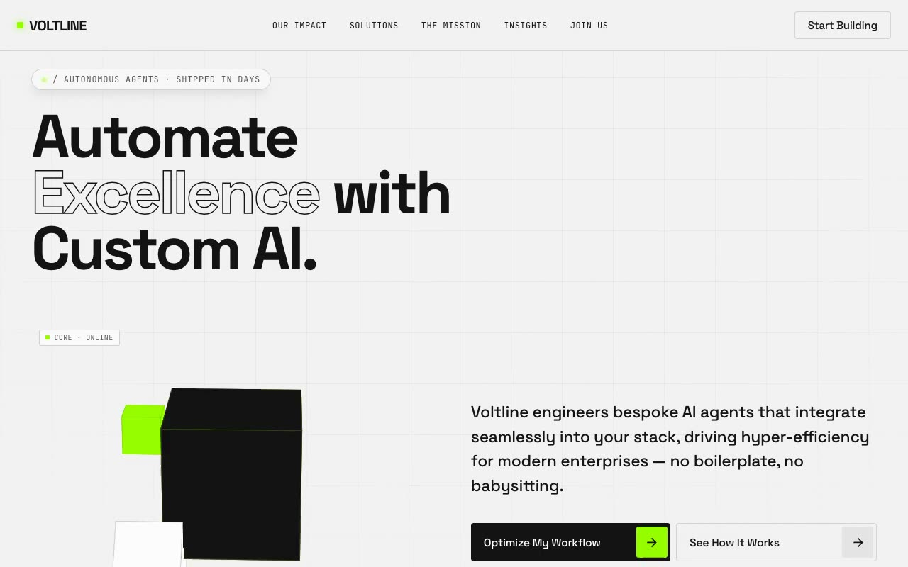

# Voltline Automation — "Bone & Volt" Industrial AI Landing Page (HTML + CSS + Vanilla JS)

[](./demo.mp4)

A single-page marketing site for **Voltline**, a fictional AI-automation company. The aesthetic identity is "Bone & Volt" — a clean, Swiss-industrial system on a warm off-white (bone) canvas, punctuated by hard graphite black and a single electric-lime accent (`rgb(152, 254, 0)`). The mood is engineering-forward and slightly retro-futurist: monospace slash-prefixed labels, tight geometric-sans headlines, orbiting 3D primitives, and tiny "space / starfield" reveals on hover. It feels like a precision instrument, not generic SaaS. Built with plain HTML, CSS, and Vanilla JS. Generated with Claude Fable 5.

Within a centered ~1240px frame, the page runs through a fixed navbar, a left-weighted hero ("Automate excellence with custom AI.") paired with a live 3D composition, a hairline-divided stats strip, a three-card solutions grid, a deep-space "The Mission" CTA band, and a bone footer with a "systems nominal" status dot. The hero centerpiece is a **pure-CSS 3D rig** (preserve-3d, ~2000px perspective): a graphite cube with a glowing lime core orb, an orbiting lime satellite cube, and a tilted white "data node" with a scanning line and `SYNC_ACTIVE` readout, the whole rig slowly rotating on Y at a fixed -20° X tilt.

The signature interaction is a randomized lime pixel-grid fill that sweeps across the "Start Building" button on hover over a deep-space backdrop; CTAs reveal twinkling starfields and arrow-chip slide wipes. Continuous motion drives the orbits, pulsing core, scanning line, and a fade-masked partner marquee, while scroll triggers IntersectionObserver reveals and an optional stats count-up. `prefers-reduced-motion` disables orbits, marquee, and twinkles. All fonts and assets are vendored locally for fully offline operation.

## Run

This is a static project — open `index.html` in a browser, or serve the folder:

```sh
python3 -m http.server 8000
```

See `prompt.md` for the full build spec; `demo.mp4` shows it in motion.

---

Part of the [Landing pages](../) collection in the [claude-directory](../../) — an open-source gallery of AI-generated UI built with Claude Fable 5. [Browse the live gallery](https://pulkitxm.com/claude-directory).
