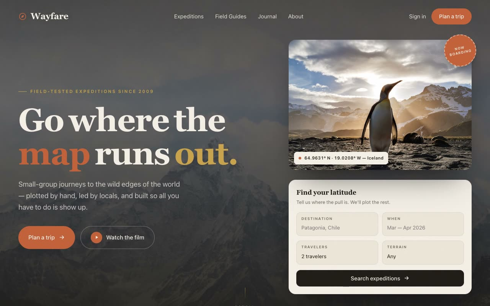

# Wayfare — Expedition Journal Boutique Travel Landing Page (HTML + CSS + Vanilla JS)

[](./demo.mp4)

A full, multi-section marketing landing page for **Wayfare**, a boutique expedition-travel company. The aesthetic identity is "Expedition Journal" — a warm, editorial, field-notebook mood that feels like a leather-bound travel diary crossed with a modern outdoor brand. It reads as deliberate and hand-curated, with generous whitespace, confident typography, and small analog details: dotted rules, coordinate tags, stamp-like badges, and hairline dividers. The palette is aged paper (`#F4EFE6`) and espresso ink with clay/terracotta, moss/pine, and ochre/brass accents; dark sections invert to espresso with paper text. Typography pairs the high-contrast editorial serif **Fraunces** (optical sizing, italic for select words) with **Inter Tight** for body and UI, plus wide-tracked uppercase eyebrows. Generated with Claude Fable 5.

The page runs top to bottom through a sticky nav that frosts on scroll, a full-viewport hero (editorial headline with a floating trip-finder card, framed parallax photograph, and "now boarding" stamp), a grayscale trust marquee, a manifesto block with a count-up stats band, a chip-filterable expeditions grid, a numbered "how it works" section, a guides carousel, a dark testimonial section, a final CTA panel, and a footer with a ghosted wordmark watermark. Built with plain HTML, CSS, and Vanilla JS.

Motion stays analog and restrained: IntersectionObserver fade-and-rise reveals with staggered delays, RAF-throttled hero parallax on the photograph and its caption tag, count-up stats, a smooth fade/scale filter transition on the expeditions grid, a hover-pausing marquee, and photo zooms with sliding link arrows. The build is accessible (semantic landmarks, alt text, keyboard-focusable controls, visible focus rings) and respects `prefers-reduced-motion`. All fonts and photography are vendored locally for fully offline operation.

## Run

This is a static project — open `index.html` in a browser, or serve the folder:

```sh
python3 -m http.server 8000
```

See `prompt.md` for the full build spec; `demo.mp4` shows it in motion.

---

Part of the [Landing pages](../) collection in the [claude-directory](../../) — an open-source gallery of AI-generated UI built with Claude Fable 5. [Browse the live gallery](https://pulkitxm.com/claude-directory).
