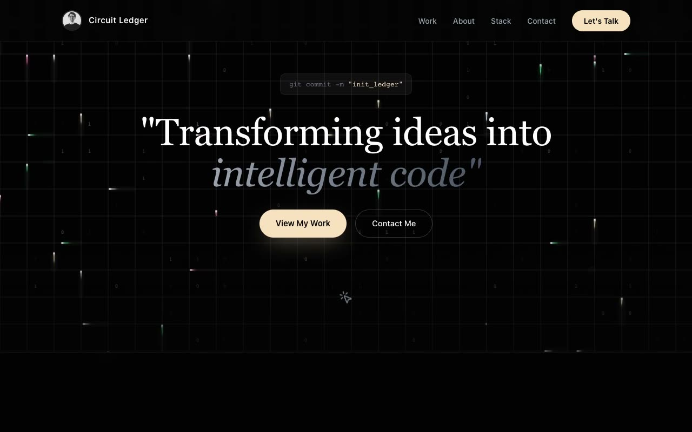

# Circuit Ledger — Dark Developer Portfolio with Live Circuit Canvas (HTML + CSS + Vanilla JS)

[](./demo.mp4)

Circuit Ledger is a single-page, forced-dark developer portfolio in a "Quiet Circuitry" design language — a near-black engineering workbench aesthetic combining hacker-terminal precision with high-end editorial print. A fixed full-viewport canvas animates faint circuit runners travelling along grid lines, scattered flipping `0`/`1` glyphs, and a mouse-following highlighted cell, all set against a void background with champagne-cream and circuit-green accents. The layout flows through hero, about, a bento technical arsenal with animated proficiency bars, device-framed featured projects, a typewriter live-stack terminal, an experience timeline, pricing, and a contact footer — with IntersectionObserver scroll reveals, scroll-spy nav, and a `prefers-reduced-motion` fallback throughout. Generated with Claude Fable 5.

## Run

This is a static project — open `index.html` in a browser, or serve the folder:

```sh
python3 -m http.server 8000
```

See `prompt.md` for the full build spec; `demo.mp4` shows it in motion.

---

Part of the [Portfolios](../) collection in the [claude-directory](../../) — an open-source gallery of AI-generated UI built with Claude Fable 5. [Browse the live gallery](https://pulkitxm.com/claude-directory).
