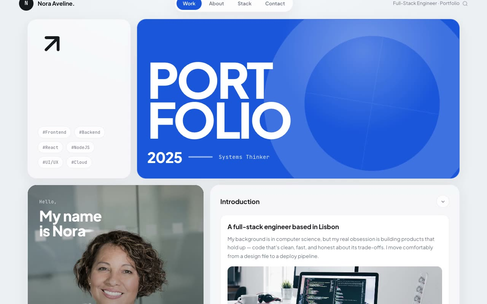

# Cobalt Bento Folio — Light-Mode Bento Grid Developer Portfolio (HTML + CSS + Vanilla JS)

[](./demo.mp4)

Cobalt Bento Folio is a single-page, forced-light personal portfolio for a fictional full-stack engineer (Nora Aveline) in a "Daylight Workbench" aesthetic — a soft, airy bento grid of frosted-glass panels floating over a cool pale-gray backdrop, anchored by one commanding royal-cobalt hero tile. The asymmetric 12-column bento layout interlocks panels of different spans into a continuous dashboard, with Plus Jakarta Sans display type and JetBrains Mono accents (both self-hosted). Vanilla JS drives staggered IntersectionObserver panel reveals, a pointer-parallax cobalt hero with cursor-tracking specular highlight, requestAnimationFrame count-up stats, an animated SVG skill ring, a typewriter role rotator, and a contact form with validation and success state — all gated behind `prefers-reduced-motion`. Generated with Claude Fable 5.

## Run

This is a static project — open `index.html` in a browser, or serve the folder:

```sh
python3 -m http.server 8000
```

See `prompt.md` for the full build spec; `demo.mp4` shows it in motion.

---

Part of the [Portfolios](../) collection in the [claude-directory](../../) — an open-source gallery of AI-generated UI built with Claude Fable 5. [Browse the live gallery](https://pulkitxm.com/claude-directory).
