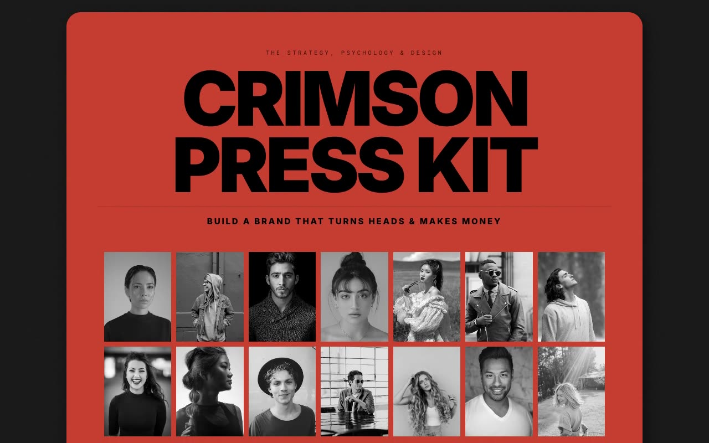

# Crimson Press Kit — Editorial Binder Designer Portfolio with Print Aesthetic (HTML + CSS + Vanilla JS)

[](./demo.mp4)

Crimson Press Kit is a single-page designer portfolio staged as a physical spiral-bound magazine / brand press kit lying open on a dark studio table — a raw, editorial, print-inspired layout where each "page" is a full-bleed card with a heavy drop shadow, joined by metal spiral-binding dividers rendered in pure SVG. Signature crimson anchors the cover and method pages against near-black ink, warm off-white paper, and dark gallery cards, with a generated noise/grain texture overlay in `mix-blend-multiply` to sell the printed feel. The binder flows cover → contents → intro → selected works → the method → contact, using a heavy uppercase grotesk for headlines, monospace for labels, and one italic serif accent word. Vanilla JS handles smooth anchor scrolling, IntersectionObserver page reveals, grayscale-to-color hovers, and a fixed "back to contents" button. Generated with Claude Fable 5.

## Run

This is a static project — open `index.html` in a browser, or serve the folder:

```sh
python3 -m http.server 8000
```

See `prompt.md` for the full build spec; `demo.mp4` shows it in motion.

---

Part of the [Portfolios](../) collection in the [claude-directory](../../) — an open-source gallery of AI-generated UI built with Claude Fable 5. [Browse the live gallery](https://pulkitxm.com/claude-directory).
