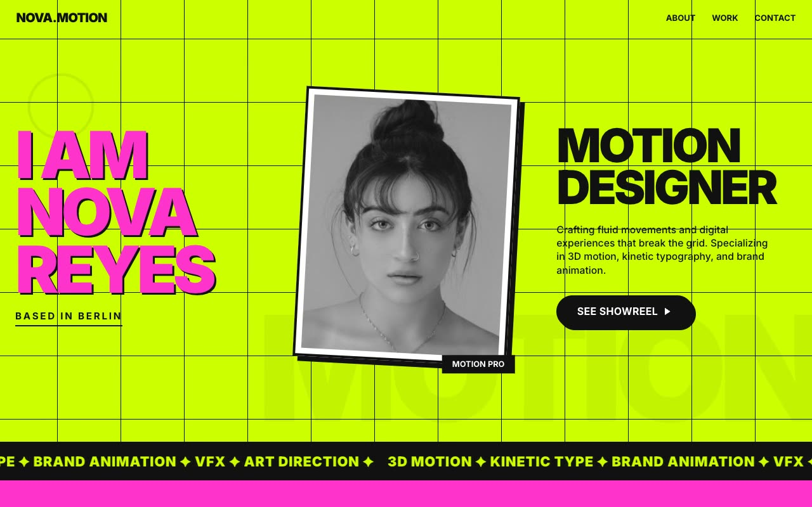

# Electric Volt Folio — Neo-Brutalist Motion Designer Portfolio (HTML + CSS + Vanilla JS)

[](./demo.mp4)

Electric Volt Folio is a fully responsive, multi-section portfolio for a fictional motion designer (Nova Reyes) in a "Kinetic Brutalism" design language — a loud, unapologetically typographic neo-brutalist poster aesthetic like a risograph zine crossed with a 3D motion reel. The design is hard-edged and high-contrast: black ink on acid-green paper punched through with hot-pink accents, thick borders, blocky no-blur offset drop-shadows, and a visible grid overlay. Oversized Inter Black display headlines pair with a monospace for meta labels across a fixed nav, a 12-column hero with rotated portrait and infinite marquee, about, count-up stats, staggered masonry work grid, pull-quote, contact, and an outlined-wordmark footer. Vanilla JS drives the scroll-aware nav state flip, tactile press-down button shadows, the pausing marquee, and IntersectionObserver counters and reveals — all respecting `prefers-reduced-motion`. Generated with Claude Fable 5.

## Run

This is a static project — open `index.html` in a browser, or serve the folder:

```sh
python3 -m http.server 8000
```

See `prompt.md` for the full build spec; `demo.mp4` shows it in motion.

---

Part of the [Portfolios](../) collection in the [claude-directory](../../) — an open-source gallery of AI-generated UI built with Claude Fable 5. [Browse the live gallery](https://pulkitxm.com/claude-directory).
