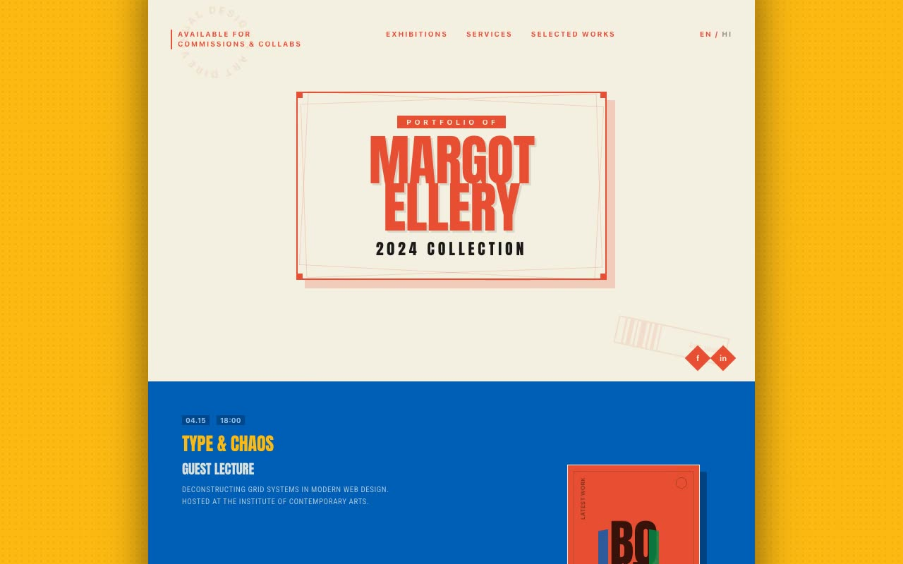

# Inkpress Atelier — Risograph Zine Graphic Designer Portfolio (HTML + CSS + Vanilla JS)

[](./demo.mp4)

Inkpress Atelier is a single-page, fully responsive portfolio for a fictional graphic designer / art director (Margot Ellery), staged as a printed risograph zine spread in a retro-modern Swiss-print aesthetic. The whole page lives inside a narrow centered cream "paper frame" with a heavy drop shadow on a marigold-yellow desk, topped by a four-color registration strip — each section reads like a separate page of the zine. The look leans on print artifacts: hard no-blur offset block shadows, `mix-blend-multiply` color overlaps, sawtooth section edges, dotted leader lines, registration corner marks, and rotated stickers, with Anton display caps and Roboto Condensed body (both self-hosted). Sections cover a logo-plate hero, full-bleed blue exhibitions, a "menu"-style services list, an alternating-color works grid, and an ink-black footer, plus an optional marquee. Vanilla JS handles an overshoot logo pop-in, springy IntersectionObserver reveals, slow-spin badges, and playful hover micro-interactions — all gated behind `prefers-reduced-motion`. Generated with Claude Fable 5.

## Run

This is a static project — open `index.html` in a browser, or serve the folder:

```sh
python3 -m http.server 8000
```

See `prompt.md` for the full build spec; `demo.mp4` shows it in motion.

---

Part of the [Portfolios](../) collection in the [claude-directory](../../) — an open-source gallery of AI-generated UI built with Claude Fable 5. [Browse the live gallery](https://pulkitxm.com/claude-directory).
