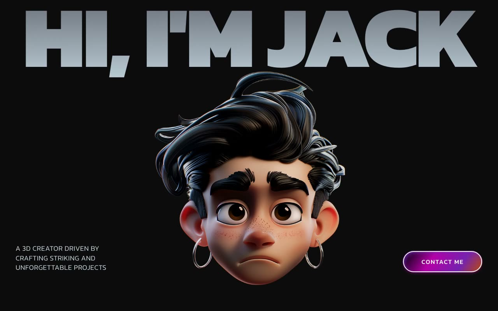

# Jack — 3D Creator Portfolio with Scroll-Driven Animations (React + TypeScript + Framer Motion + Tailwind CSS)

[](./demo.mp4)

Jack is a dark-themed portfolio landing page for a 3D creator, built with React 18, TypeScript, Tailwind CSS, and Framer Motion (Vite toolchain, Kanit typeface). The page flows through five sections — a full-viewport hero with magnetic portrait, a scroll-driven dual marquee of project GIFs, an about section with character-by-character text reveal, a white services list, and sticky-stacking project cards that scale as you scroll past them. Key techniques include scroll-position-driven marquee rows that move in opposite directions, a mouse-magnetic hover effect (`Magnet` component), per-character opacity animation linked to scroll progress (`AnimatedText`), and Framer Motion `useScroll` / `useTransform` for the sticky card scale-down — all with fluid `clamp()` typography. Generated with Claude Fable 5.

## Commands

```bash
npm install
npm run dev       # local dev server
npm run build     # type-check + production build
npm run preview   # serve the production build
```

---

Part of the [Portfolios](../) collection in the [claude-directory](../../) — an open-source gallery of AI-generated UI built with Claude Fable 5. [Browse the live gallery](https://pulkitxm.com/claude-directory).
