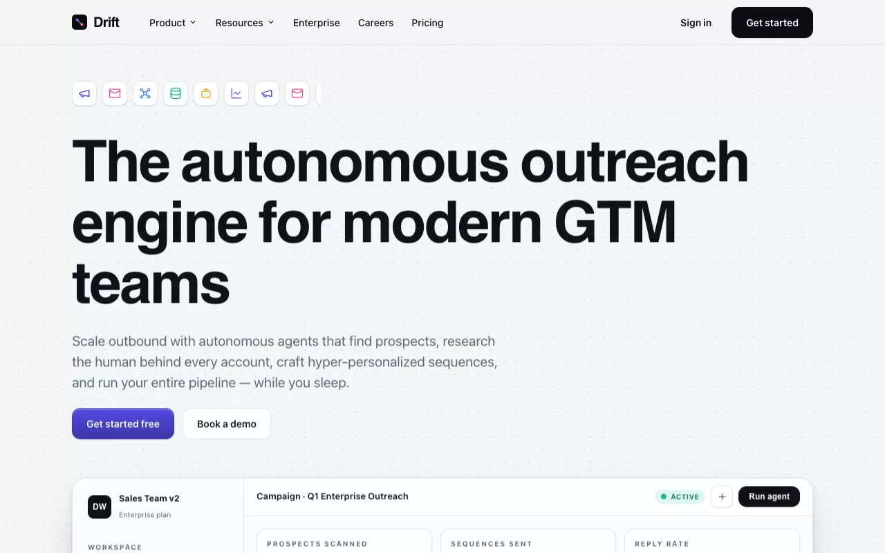

# Lumen Folio — Soft Editorial Minimalist Designer Portfolio (HTML + CSS + Vanilla JS)

[](./demo.mp4)

Lumen Folio is a single-page personal portfolio for a fictional independent designer (Noa Wilde) in a "Soft Editorial Minimalism" aesthetic — a bright, airy, paper-white canvas with oversized rounded cards, generous whitespace, a floating glass navigation pill, and calm micro-interactions, like a well-printed design magazine translated to the web. A high-contrast editorial serif pairs with a humanist sans, with a warm terracotta accent used sparingly. Sections run a floating glass nav pill, a centered hero with typewriter rotating word, a drag-scroll snapping work carousel, about with overlapping straighten-on-hover polaroids, a timeline, browser-window project showcases, a services grid, testimonials, and a contact form with inline success state. Vanilla JS handles IntersectionObserver scroll reveals, the typewriter rotator, the click-and-drag carousel, and the fake contact handler — all respecting `prefers-reduced-motion`. Generated with Claude Fable 5.

## Run

This is a static project — open `index.html` in a browser, or serve the folder:

```sh
python3 -m http.server 8000
```

See `prompt.md` for the full build spec; `demo.mp4` shows it in motion.

---

Part of the [Portfolios](../) collection in the [claude-directory](../../) — an open-source gallery of AI-generated UI built with Claude Fable 5. [Browse the live gallery](https://pulkitxm.com/claude-directory).
