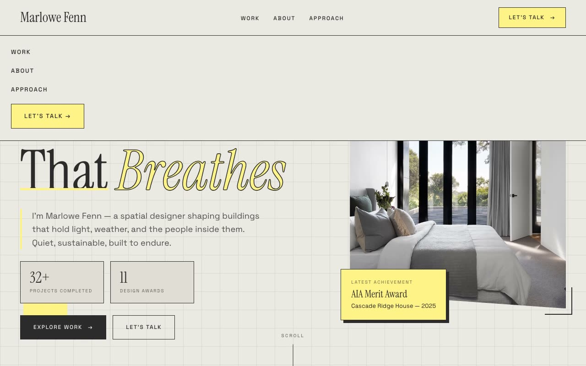

# Meridian Drafthouse — Architect Portfolio with Drafting-Table Brutalism (HTML + CSS + Vanilla JS)

[](./demo.mp4)

Meridian Drafthouse is a single-page, fully responsive portfolio for a fictional architect and spatial designer (Marlowe Fenn) in a "Drafting-Table Brutalism" aesthetic — a warm, paper-cream, Swiss-archival design language that reads like a licensed architect's working drawing set: blueprint grids, 1px ink hairlines, mono annotation labels, and one electric highlighter-yellow accent. Type is Instrument Serif display with Space Grotesk labels (both self-hosted), with one hero word rendered as an outlined italic. Sections run a fixed header, a full-viewport blueprint-grid hero with masked type-rise and sliding image-reveal overlay, a count-up stats strip, selected work, about, a design-focus grid, an inverted-ink process table, testimonials, a contact CTA, and a footer. Vanilla JS drives IntersectionObserver reveals, overflow-masked headline rise, scale-X image unveils, a pulsing status dot, and stat count-ups — all respecting `prefers-reduced-motion`. Generated with Claude Fable 5.

## Run

This is a static project — open `index.html` in a browser, or serve the folder:

```sh
python3 -m http.server 8000
```

See `prompt.md` for the full build spec; `demo.mp4` shows it in motion.

---

Part of the [Portfolios](../) collection in the [claude-directory](../../) — an open-source gallery of AI-generated UI built with Claude Fable 5. [Browse the live gallery](https://pulkitxm.com/claude-directory).
