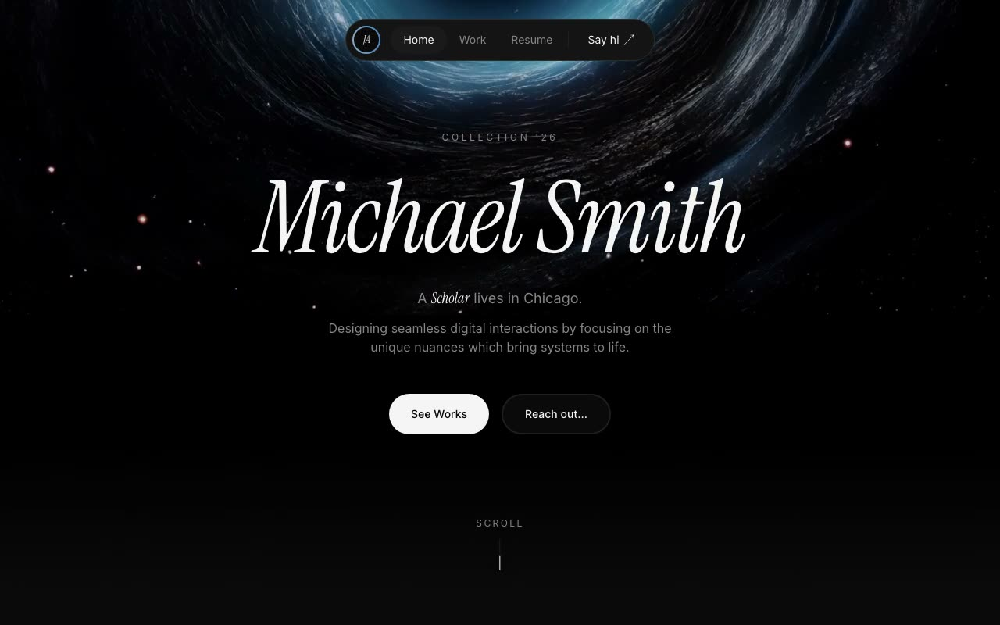

# Michael Smith — Dark Portfolio Landing Page (React 18 + GSAP + Framer Motion + TypeScript + Vite)

[](./demo.mp4)

A single-page, forced-dark portfolio landing page for a fictional Chicago designer/developer built with React 18, TypeScript, Vite, and Tailwind CSS. It opens with an animated loading screen, then reveals a full-viewport hero backed by a looping HLS video, followed by selected works in a bento grid, a journal feed, a GSAP ScrollTrigger-pinned parallax gallery with lightbox, animated count-up stats, and a contact footer with a GSAP marquee and a second HLS video. Animations are driven by GSAP (entrance timelines, ScrollTrigger pinning and parallax, marquee) and Framer Motion (in-view reveals, route and page transitions, presence transitions); background video uses `hls.js` loaded lazily via dynamic `import()` with native HLS fallback for Safari. Notable techniques include `requestAnimationFrame` counters, a scroll-spy navbar, GSAP `ScrollTrigger.create` pin with scrubbed parallax, and animated CSS gradient ring borders with a `#89aacc → #4e85bf` accent palette. Generated with Claude Fable 5.

## Run

```sh
npm install
npm run dev       # dev server
npm run build     # type-check (tsc --noEmit) + production build
npm run lint      # tsc --noEmit
npm run preview   # serve the production build
npm run verify    # node scripts/verify.mjs
```

See `prompt.md` for the full build spec; `demo.mp4` shows it in motion.

---

Part of the [Portfolios](../) collection in the [claude-directory](../../) — an open-source gallery of AI-generated UI built with Claude Fable 5. [Browse the live gallery](https://pulkitxm.com/claude-directory).
