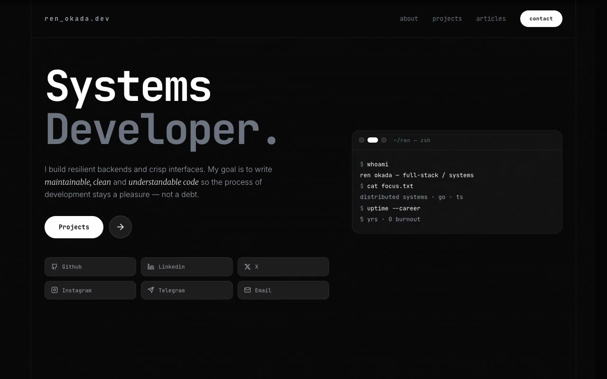

# Monogram Terminal — Monochrome Editorial Developer Portfolio (Vanilla HTML/CSS/JS, Static)

[](./demo.mp4)

A single-page, forced-dark personal portfolio for a fictional full-stack and systems developer (Ren Okada) in a "Monochrome Terminal Editorial" design language: a strictly greyscale near-black canvas that fuses the discipline of a code editor with the typographic precision of a high-end print magazine. The entire palette is black, white, and grey — no hue anywhere — with JetBrains Mono for display type and section labels formatted as file-path terminal breadcrumbs (`~/work`, `cd projects/`), Inter for body copy, and Merriweather italic for pull-quote emphasis. A narrow centered column is framed by hairline vertical borders with a faint film-grain and scanline overlay for CRT depth. Sections run a sticky blurred header, a mono hero with social chips, an auto-advancing cross-fading featured slider, an about column, four-up technology stack cards, a vertical work timeline, a projects grid, a paginated articles grid, and a contact footer. Vanilla JS drives fade-rise IntersectionObserver reveals, the auto-advance slider with animated pill dots, grayscale-to-color image hovers, and a slide-in mobile menu — all respecting `prefers-reduced-motion`. Self-contained static build, all fonts and imagery vendored locally, runs fully offline. Generated with Claude Fable 5.

## Run

This is a static project — open `index.html` in a browser, or serve the folder:

```sh
python3 -m http.server 8000
```

See `prompt.md` for the full build spec; `demo.mp4` shows it in motion.

---

Part of the [Portfolios](../) collection in the [claude-directory](../../) — an open-source gallery of AI-generated UI built with Claude Fable 5. [Browse the live gallery](https://pulkitxm.com/claude-directory).
