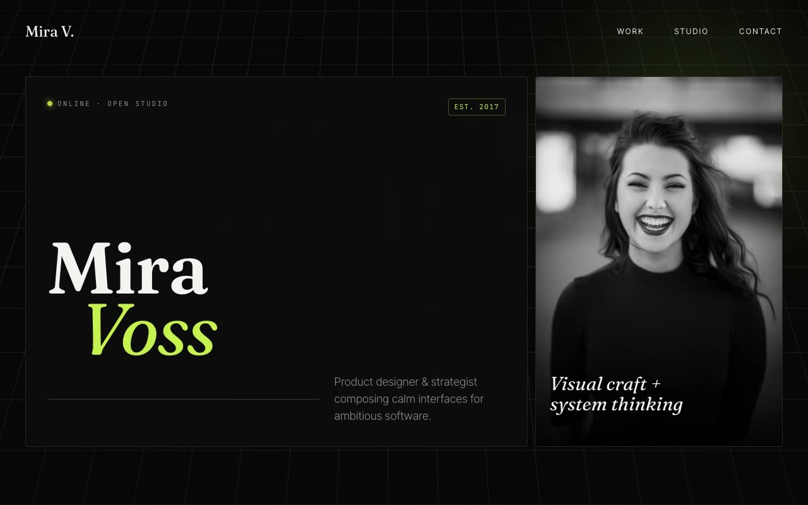

# Nocturne Bento — Midnight Atelier Designer Portfolio with Bento Grid Hero (Vanilla HTML/CSS/JS, Static)

[](./demo.mp4)

A single-page, forced-dark personal portfolio for a fictional independent product designer (Mira Voss) in a "Midnight Atelier" aesthetic: a near-black studio canvas with a slowly drifting perspective grid floor, oversized editorial serif display type paired with a tight grotesque, a monospace accent for status pills and data labels, and a single electric acid-lime accent (`#C6F24E`) used sparingly against greyscale photography. The signature structural device is a bento-grid hero of asymmetric glass panels — a name panel, a tall portrait panel, a quote panel, a solid acid-lime CTA tile, and a stats tile — that together compose the above-the-fold. The fixed background layers a solid ink base, an animated `perspective` CSS grid floor that pans infinitely, a radial vignette, and a blurred accent orb. The header uses `mix-blend-mode: difference` for legibility over any panel. Further sections include a 2×2 selected-work grid with hairline cell dividers, a two-column studio/about section, numbered services cards, and a contact section with a glass-card validated form. Vanilla JS drives IntersectionObserver scroll reveals, pointer-parallax on hero panels, a mobile overlay menu, and the form success state — all respecting `prefers-reduced-motion`. Pure static site, all assets vendored locally, runs fully offline. Generated with Claude Fable 5.

## Run

This is a static project — open `index.html` in a browser, or serve the folder:

```sh
python3 -m http.server 8000
```

See `prompt.md` for the full build spec; `demo.mp4` shows it in motion.

---

Part of the [Portfolios](../) collection in the [claude-directory](../../) — an open-source gallery of AI-generated UI built with Claude Fable 5. [Browse the live gallery](https://pulkitxm.com/claude-directory).
