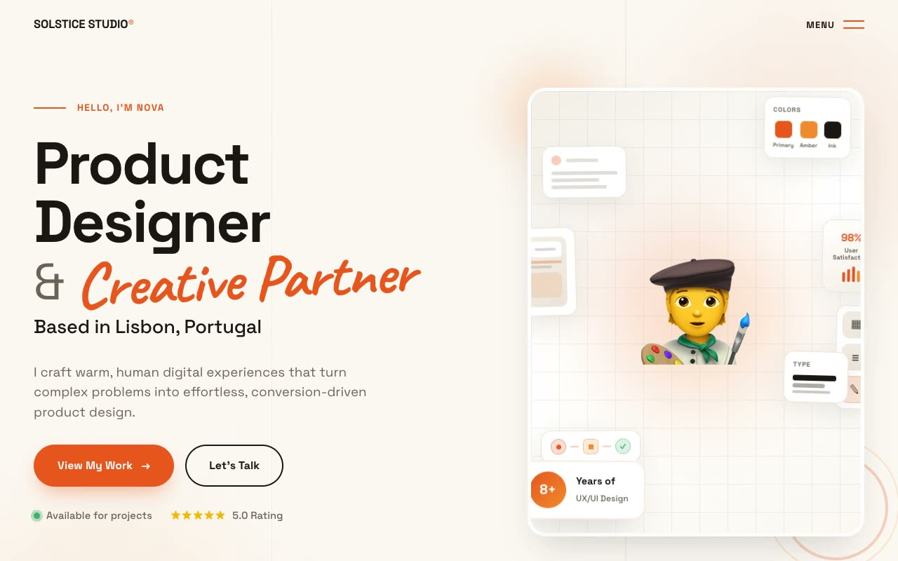

# Solstice Studio — Warm Editorial Craft UX Designer Portfolio (Vanilla HTML/CSS/JS, Static)

[](./demo.mp4)

A single-page, light-mode portfolio landing page for a fictional product and UX designer (Nova Ayala) under the studio identity Solstice Studio®, built in a "Warm Editorial Craft" aesthetic: a bright paper-white canvas (`#FBF8F3`), a single confident tangerine accent, Space Grotesk for display and body type crossed with self-hosted Caveat for handwritten accent words, and faint vertical margin-rule lines that make the page feel like a designer's ruled sketchbook. The above-the-fold hero features mixed grotesque/handwritten typography and a cluster of gently bobbing floating design-tool micro-cards (colors swatch, wireframe nav mock, mobile UI frame, Figma-style tool rail, type scale preview, satisfaction metric badge, user-flow diagram, and experience badge). Further sections include an infinite logo ticker band, a 3D-perspective auto-scrolling selected-work shelf (`perspective(1200px) rotateX(25deg) rotateY(-6deg)`), expertise cards with a growing accent bar on hover, an animating 4-step process timeline with a tangerine gradient progress line, testimonial cards, a gradient CTA section, and an overlapping dark footer. Vanilla JS drives floating card keyframes, the logo ticker, the scroll-in progress line, count-up stats, and hover micro-interactions. Plain static site, all assets vendored locally, runs fully offline. Generated with Claude Fable 5.

## Run

This is a static project — open `index.html` in a browser, or serve the folder:

```sh
python3 -m http.server 8000
```

See `prompt.md` for the full build spec; `demo.mp4` shows it in motion.

---

Part of the [Portfolios](../) collection in the [claude-directory](../../) — an open-source gallery of AI-generated UI built with Claude Fable 5. [Browse the live gallery](https://pulkitxm.com/claude-directory).
