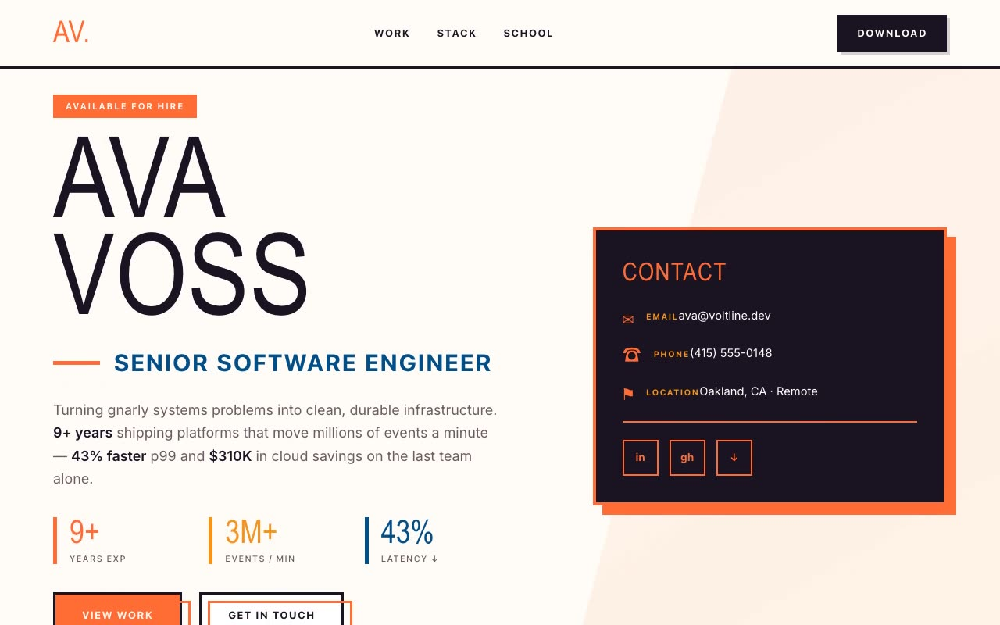

# Voltline — Neo-Brutalist Engineer Resume Portfolio (HTML + CSS + Vanilla JS)

[](./demo.mp4)

Voltline is a single-page, multi-section personal portfolio and printable digital resume for a senior software engineer, designed as a loud neo-brutalist broadsheet on warm cream "paper" with a faint orange dot-grid. The layout is defined by thick ink-black outlines, hard no-blur offset drop shadows, high-contrast orange-on-ink blocks, and deliberately skewed bands that tilt sections just enough to feel hand-set — no gradients, no rounded cards, no shadow blur. Display type is Bebas Neue for the giant hero name and section titles, Space Grotesk for labels and buttons, and Inter for body copy — all self-hosted. A sticky header "DOWNLOAD" button triggers `window.print()` to produce a clean printable PDF, with scroll-reveal animations, count-up stat numbers, and parallax on the hero diagonal wedge. Generated with Claude Fable 5.

## Run

This is a static project — open `index.html` in a browser, or serve the folder:

```sh
python3 -m http.server 8000
```

See `prompt.md` for the full build spec; `demo.mp4` shows it in motion.

---

Part of the [Portfolios](../) collection in the [claude-directory](../../) — an open-source gallery of AI-generated UI built with Claude Fable 5. [Browse the live gallery](https://pulkitxm.com/claude-directory).
