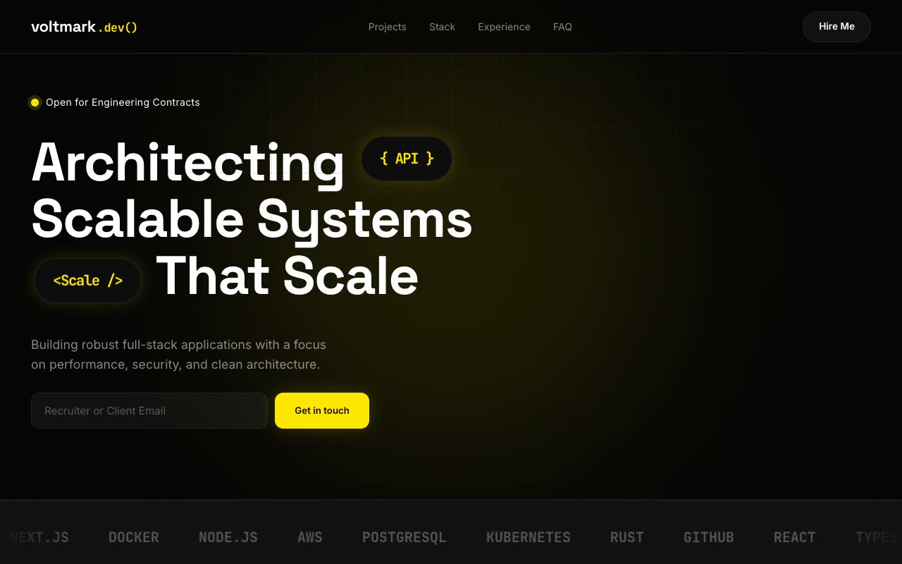

# Voltmark — Dark-Mode Engineer Terminal Portfolio (HTML + CSS + Vanilla JS)

[](./demo.mp4)

Voltmark is a single-page, dark-mode personal portfolio for a senior full-stack and systems engineer built around a "developer workstation at 2am" aesthetic — deepest near-black canvas (`#050505`), a single electric-yellow accent, monospace code texture, faint technical grid lines, and soft yellow glow bloom. Sections run a fixed header, a mouse-following blurred yellow blob hero with inline floating "code chip" pills, a tech brand marquee, an about column beside a live typewriter terminal window, a filterable projects grid with rendered code-snippet previews, an experience accordion with animated skill bars, a numbered services grid, an FAQ accordion, and a contact footer with a form. Type is Space Grotesk, Inter, and JetBrains Mono — all self-hosted; vanilla JS drives IntersectionObserver reveals, eased blob parallax, floating animations, the terminal typewriter, count-up counters, the marquee, and project filters. Generated with Claude Fable 5.

## Run

This is a static project — open `index.html` in a browser, or serve the folder:

```sh
python3 -m http.server 8000
```

See `prompt.md` for the full build spec; `demo.mp4` shows it in motion.

---

Part of the [Portfolios](../) collection in the [claude-directory](../../) — an open-source gallery of AI-generated UI built with Claude Fable 5. [Browse the live gallery](https://pulkitxm.com/claude-directory).
