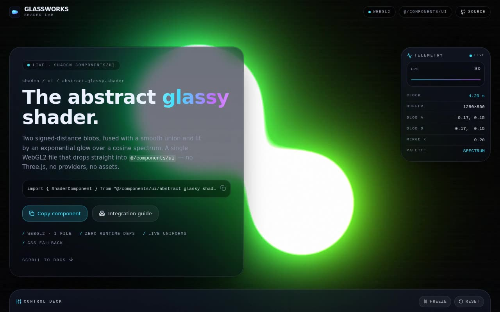

# Abstract Glassy Shader — WebGL2 Metaball Component Lab (React + TypeScript + Vite + Tailwind CSS)

[](./demo.mp4)

Abstract Glassy Shader — branded as GLASSWORKS — is a React + TypeScript + Vite + Tailwind CSS v4 project that integrates a raw WebGL2 metaball field: two signed-distance circles fused with a smooth union operator, lit by an exponential glow over a cosine-spectrum palette. The live shader runs as a fixed, full-viewport background; layered above it are a frosted-glass hero, a live telemetry HUD reading the shader's own per-frame state (clock, FPS, blob centres, merge `k`, palette), and a control deck whose faders promote baked-in constants to live uniforms. Below the fold is the integration story — the shadcn drop-in path, copyable source tabs, a shader anatomy walkthrough, and a props/uniforms API reference. The component has a CSS metaball fallback when WebGL2 is unavailable, cleans up its GL program on unmount without losing context, and respects `prefers-reduced-motion`. Generated with Claude Fable 5.

## Run

```bash
npm install
npm run dev      # http://localhost:5173
npm run build    # type-check (tsc -b) + production build
```

## Integration notes (answering the prompt)

This repo already satisfies the required stack, so no project bootstrap was needed:

- **shadcn project structure** — `components.json` is present, the `@` alias resolves to `./src`
  (configured in both `vite.config.ts` and `tsconfig`), the `cn()` helper lives in
  `src/lib/utils.ts`, and UI components live in **`src/components/ui/`**.
- **Tailwind CSS** — Tailwind **v4** via `@tailwindcss/vite`; the entry stylesheet
  `src/index.css` begins with `@import "tailwindcss";` and `@import "tw-animate-css";`.
- **TypeScript** — strict mode with project references (`tsconfig.app.json` / `tsconfig.node.json`).

If you were starting from scratch instead:

```bash
npm create vite@latest my-app -- --template react-ts
cd my-app
npm install tailwindcss @tailwindcss/vite tw-animate-css
npx shadcn@latest init          # creates components.json + the @/ alias + src/lib/utils.ts
```

### Why `components/ui`

shadcn's `components.json` pins the `ui` alias to `@/components/ui`. The CLI (`npx shadcn add …`)
writes generated primitives there, and every component import in the ecosystem is written as
`@/components/ui/<name>`. Keeping this exact folder means the prompt's
`import { ShaderComponent } from "@/components/ui/abstract-glassy-shader"` resolves unchanged, and
any future `shadcn add` lands its files in the same place without churn. This project's default
component path **is** `src/components/ui`, so the component was copied there (made TypeScript-correct
and given optional props — see below).

### Component questions

- **Props / data** — the source component took **no props**; `<ShaderComponent />` still renders the
  original frame exactly. The integrated version adds three optional props: `settings`
  (`Partial<ShaderSettings>` — promotes the hard-coded constants such as radii, merge `k`, glow and
  palette to live uniforms; omit any field to keep the original value), `onFrame` (a per-frame
  telemetry callback), and `className` / `style`. **Defaults reproduce the source shader
  frame-for-frame.**
- **State** — local only. The page lifts the `ShaderSettings` into one `useState` in `App.tsx` and
  feeds per-frame stats through a `ref` (so 60 fps telemetry never thrashes React). No global store
  or context provider is required.
- **Assets** — **none.** The field is 100% procedural GLSL — no images, no 3D models, no Three.js.
  Type uses a system font stack and all icons are `lucide-react`, so the project runs fully offline.
  (The prompt's "fill image assets with Unsplash" / "use lucide-react for logos" steps don't apply —
  the component needs no imagery; the brand mark is an inline SVG and UI glyphs are Lucide.)
- **Responsive behavior** — full-bleed shader on every breakpoint. The hero panel scales
  (`text-[2.4rem] → text-[3.1rem]`), the telemetry HUD is shown from `lg` up, the control-deck faders
  reflow from 2 → 3 → 4 columns, the docs tables scroll horizontally rather than overflow the page,
  and there is no horizontal overflow at 390 px.
- **Best placement** — as a hero / section background. The canvas fills its parent, so the idiomatic
  use is a `fixed inset-0` (or `relative h-screen`) wrapper with foreground content layered on top —
  exactly what `App.tsx` and `src/components/ui/demo.tsx` demonstrate.

## Robustness

`getContext("webgl2")` is guarded and a `webglcontextlost` listener is wired up. If WebGL2 is
unavailable, the component renders an animated **CSS metaball fallback** instead of crashing or going
flat black. The renderer frees its GL program/buffer on unmount **without** losing the context, so
React StrictMode's dev double-mount (which reuses the same canvas) re-initialises cleanly. The shader
declares `precision highp int;` for the palette selector so it compiles under strict ES 3.00
(SwiftShader) as well as native drivers, and `prefers-reduced-motion` starts the clock frozen.

## Verification

`scripts/verify.mjs` is a headless check (Playwright, run against a live dev server) that asserts no
console/page errors, that the WebGL2 canvas mounts and **paints visible light** (it decodes a
screenshot region, not just `readPixels`), that the hero / telemetry / control-deck / docs all
render, that the seven uniform faders are wired, that the **Freeze** control actually flips the HUD
to `Frozen`, and that the mobile layout has no horizontal overflow. It adapts to the environment
(WebGL present → asserts the canvas; absent → asserts the CSS fallback engaged).

```bash
# from the project folder, with Playwright resolvable:
URL=http://localhost:5312/ node scripts/verify.mjs
```

---

Part of the [Shaders](../) collection in the [claude-directory](../../) — an open-source gallery of AI-generated UI built with Claude Fable 5. [Browse the live gallery](https://pulkitxm.com/claude-directory).
